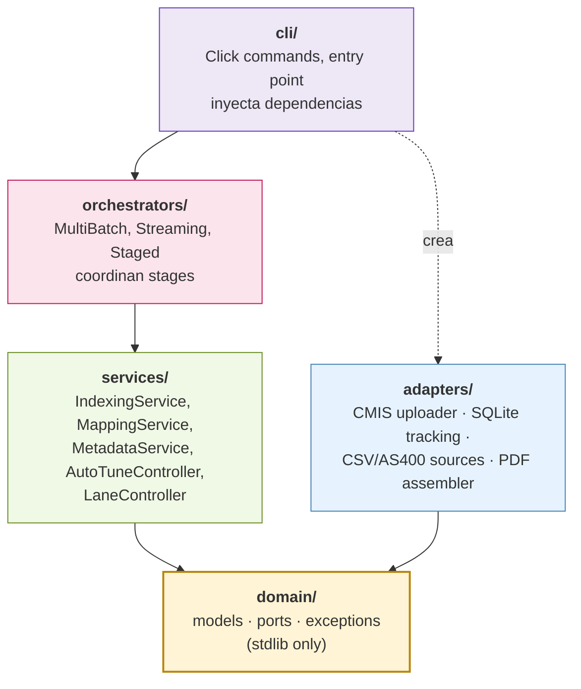

# Capas hexagonales

> [← Volver al índice](../INDEX.md) · [Diagramas](README.md)

CMCourier sigue Ports & Adapters. Cuatro capas, dependencia direccional estricta.

## Vista de capas

## Regla de dependencias

- **Solo flechas hacia abajo (o hacia domain).** `services/` nunca importa de `adapters/`. `orchestrators/` nunca importa adapters concretos.
- **`domain/` no importa nada externo.** Solo Python stdlib. Ni `pydantic`, ni `requests`, ni `pyodbc`. Nada.
- **`cli/` es el único que toca todo.** Es el composition root: ahí se instancian los adapters concretos y se inyectan.

## Lo que querés sentir cuando leés el código

| Síntoma | Diagnóstico |
|---------|-------------|
| `from cmcourier.adapters.X import Y` en un service | Violación. Refactorear vía port en `domain/`. |
| `import requests` en `services/` | Violación. Lo mismo. |
| `import pydantic` en `domain/` | Violación. Los modelos del dominio son dataclasses puras. |
| `from cmcourier.orchestrators.X import Y` en un adapter | Violación gigante. Sentido contrario. |

## Ver también

- [explanation/architecture-overview.md](../explanation/architecture-overview.md) — el "por qué"
- [adr/001-hexagonal-architecture.md](../adr/001-hexagonal-architecture.md)
- [Constitution Principio I](../../.specify/memory/constitution.md)
- [file-imports-map.md](file-imports-map.md)
