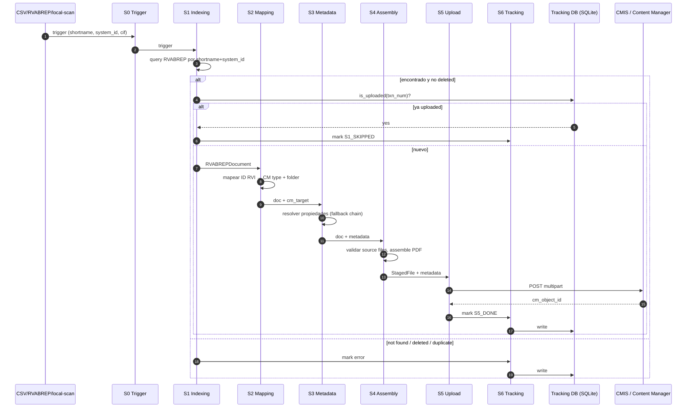
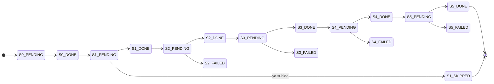

# Flujo S0 → S7

> [← Volver al índice](../INDEX.md) · [Diagramas](README.md)

Vida de un documento desde que un trigger lo nombra hasta que queda confirmado en Content Manager.

## Secuencia

## Tracking writes por stage

Cada transición persiste en `migration_log`:

## Thread model por stage

| Stage | Dónde corre | Pool / mecanismo |
|-------|-------------|------------------|
| S0 | main / producer thread | iterator |
| S1, S2, S3 | prep workers (`processing.prep_workers`) | `ThreadPoolExecutor` |
| S4 | process pool (066, default on) | `ProcessPoolExecutor` con `spawn` |
| S5 | upload workers (AIMD-resizable, `cmis.workers`) | `ThreadPoolExecutor` + `ResizableSemaphore` |
| S6 | writer thread (daemon, SQLite WAL) | `queue.Queue` drain loop |

## Ver también

- [explanation/pipeline-stages.md](../explanation/pipeline-stages.md) — narrativa completa
- [state-machine.md](state-machine.md) — más detalle de estados
- [streaming-pipeline.md](streaming-pipeline.md) — vista de pipeline en modo streaming
- [reference/tracking-db-schema.md](../reference/tracking-db-schema.md)
