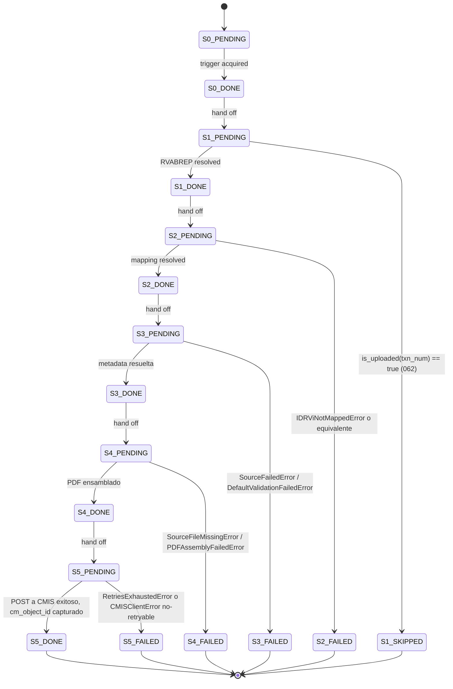

# State machine de `migration_log.status`

> [← Volver al índice](../INDEX.md) · [Diagramas](README.md)

Cada fila en `migration_log` (SQLite tracking) tiene un campo `status` que indica en qué stage está ese documento. La state machine es estrictamente sucesiva.

## Estados y transiciones



## Reglas

- Transiciones son **estrictamente hacia adelante**. No hay `S3_DONE → S2_PENDING`.
- Solo `Sn_FAILED → Sn_PENDING` se permite vía `cmcourier batch retry-failed --stage SN` (re-corrida explícita).
- `S1_SKIPPED` es **terminal** — el doc ya está en Content Manager, no hay nada que hacer.
- `cm_object_id` se persiste solo en `S5_DONE`. Las otras filas tienen `NULL`.
- `error_message` se persiste en cualquier `*_FAILED`.

## Idempotencia cross-batch

La unicidad está garantizada por `UNIQUE INDEX idx_migration_log_txn_batch (rvabrep_txn_num, batch_id)`. Re-correr el mismo batch_id falla en insert. Re-correr otro batch_id procesa pero el primer chequeo de S1 detecta `is_uploaded(txn_num) == true` vía `INDEX idx_migration_log_uploaded ON (rvabrep_txn_num) WHERE status='S5_DONE'` y marca `S1_SKIPPED`.

## Query típica para diagnóstico

```sql
SELECT status, COUNT(*) AS n
FROM migration_log
WHERE batch_id = 'mi-batch-001'
GROUP BY status
ORDER BY status;
```

## Ver también

- [reference/tracking-db-schema.md](../reference/tracking-db-schema.md)
- [explanation/idempotency-and-retries.md](../explanation/idempotency-and-retries.md)
- [reference/error-codes.md](../reference/error-codes.md)
- [how-to/operator/retry-only-failed-records.md](../how-to/operator/retry-only-failed-records.md)
