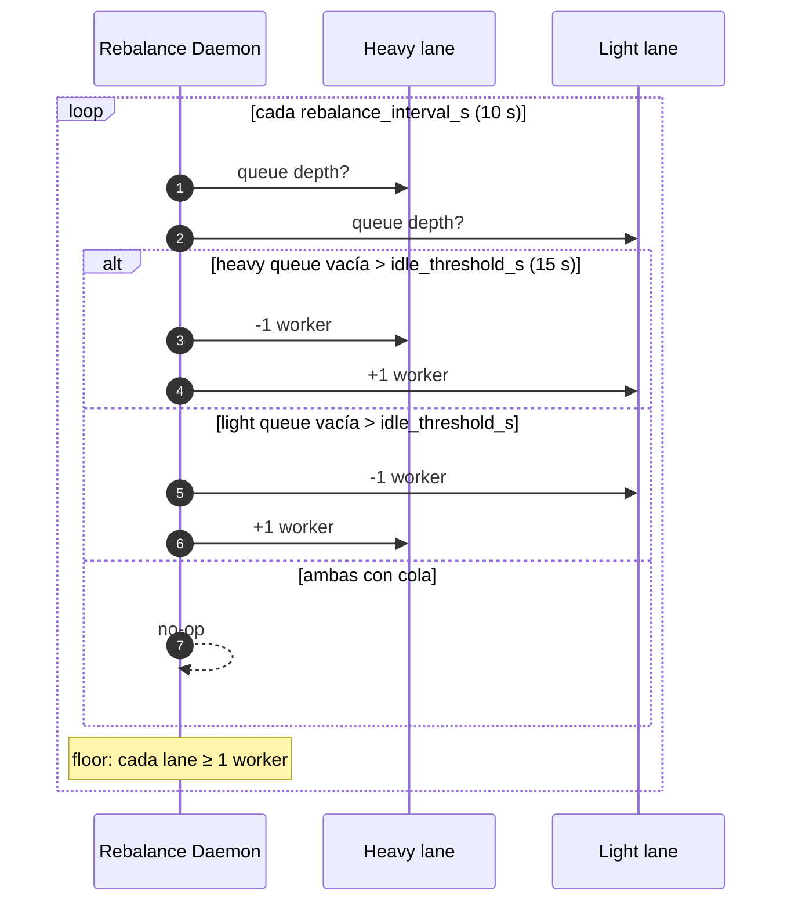
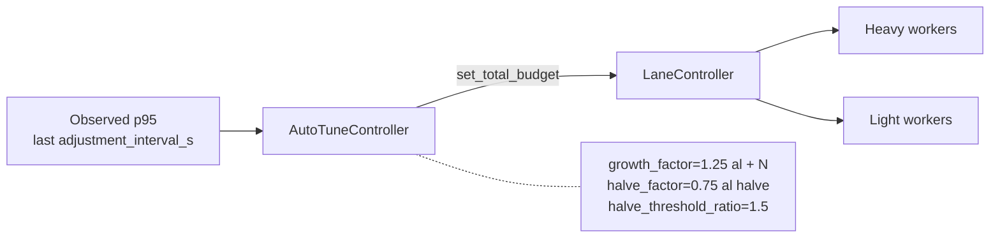

# Pipeline en modo streaming

> [← Volver al índice](../INDEX.md) · [Diagramas](README.md)

Vista de la pipeline en `processing.mode: "streaming"` (spec 063), con lanes activas (specs 065/070).

## Vista en alto nivel

```mermaid
flowchart LR
    SRC[Triggers<br/>CSV / RVABREP]
    PREP[Prep Workers<br/>S1 → S2 → S3 → S4<br/>processing.prep_workers]
    BUCKET[(Bucket<br/>queue.Queue<br/>bounded, bucket_size)]
    DISPATCH[Dispatcher]
    HEAVY[Heavy Lane<br/>docs ≥ 10 MB<br/>ResizableSemaphore]
    LIGHT[Light Lane<br/>docs &lt; 10 MB<br/>ResizableSemaphore]
    CM[CMIS / Content Manager]
    TDB[(SQLite Tracking)]

    SRC -->|stream| PREP
    PREP -->|StagedFile| BUCKET
    BUCKET --> DISPATCH
    DISPATCH -->|by size| HEAVY
    DISPATCH -->|by size| LIGHT
    HEAVY -->|POST multipart| CM
    LIGHT -->|POST multipart| CM
    CM -.cm_object_id.-> TDB
    PREP -.S1..S4 status.-> TDB
```

## Back-pressure mechanics

- `bucket.put(...)` se **bloquea** cuando la cola está llena.
- Si los upload workers son lentos, la cola se llena → prep workers se bloquean → S0 deja de producir.
- Resultado: el throughput está limitado por el bottleneck más lento, sin acumular memoria.

## Rebalance entre lanes



## AIMD orquestando el total

El total budget de workers de upload (heavy + light) es el output del `AutoTuneController`:



## Poison-pill shutdown

Cuando S0 termina (StopIteration):

1. Producer pone `N` poison pills en el bucket (uno por consumer).
2. Cada consumer al recibir poison sale de su loop.
3. Cuando todos los consumers terminaron, el writer thread del tracking flushea y cierra.

Esto garantiza que ningún documento queda en la cola cuando el orchestrator declara terminado.

## Ver también

- [explanation/streaming-vs-batched.md](../explanation/streaming-vs-batched.md)
- [explanation/the-bucket-pattern.md](../explanation/the-bucket-pattern.md)
- [explanation/heavy-light-lanes.md](../explanation/heavy-light-lanes.md)
- [explanation/aimd-auto-tuning.md](../explanation/aimd-auto-tuning.md)
- [adr/003-streaming-mode.md](../adr/003-streaming-mode.md)
