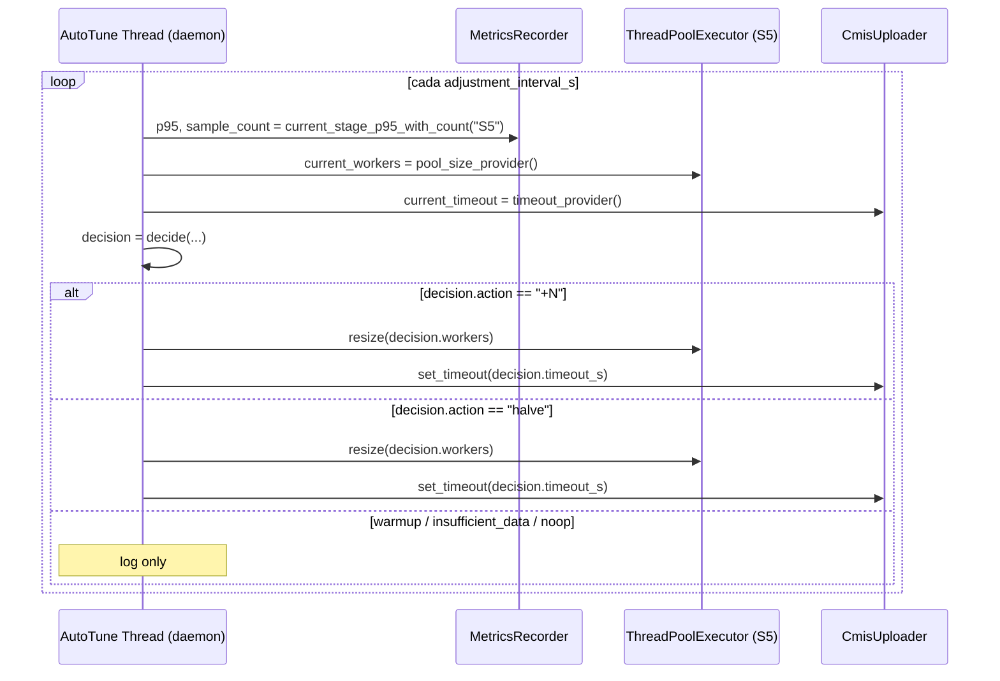

# AIMD auto-tuning: por qué `1.25×` y no `+1`, por qué `0.75×` y no `÷2`

> [← Volver al índice](../INDEX.md) · [Explanation](README.md)

## El problema que estamos resolviendo

¿Cuántos workers tendría que tener el pool de uploads (S5)? La pregunta no tiene una respuesta fija. Depende de:

- El **ancho de banda** efectivo entre CMCourier y el servidor CMIS (puede ir de 10 Mbps a 1 Gbps).
- El **tamaño promedio** de los documentos (un 50 MB tarda mucho más que un 200 KB).
- La **carga del servidor** CMIS en ese momento (Alfresco con su pool de threads, Tomcat con su connector pool, todos sus checks de seguridad).
- La **estabilidad de la red** corporativa (un firewall que mete latencia, un VPN que se reconecta).

Una configuración estática (`cmis.workers: 16` y listo) gana en el 5% de los casos. En el resto vas a estar:

- **Sub-dimensionado** cuando la red está buena (dejás throughput sobre la mesa).
- **Sobre-dimensionado** cuando la red se degrada (CMIS se llena de timeouts, retries, y latencia agregada).

La solución es un **controlador que ajusta el tamaño del pool en runtime** según una señal observable: la latencia p95 de los uploads. Ese controlador es **AIMD** (Additive Increase / Multiplicative Decrease), un algoritmo clásico del control de congestión TCP, adaptado al mundo de los workers.

## El algoritmo, de un párrafo

Cada `adjustment_interval_s` (default 30 s), el controlador despierta y lee:

1. El **p95** actual de latencia de S5 (en ms), agregado por `MetricsRecorder`.
2. La **cantidad de samples** que componen ese p95.

Compara contra `target_p95_ms` (default 5000 ms) y decide:

| Señal observada | Acción | Workers nuevos | Timeout nuevo |
|-----------------|--------|----------------|---------------|
| `elapsed < warmup_seconds` | `warmup` | sin cambio | sin cambio |
| `sample_count < min_samples` | `insufficient_data` | sin cambio | sin cambio |
| `p95 < 0.8 × target` | **+N** (grow) | `max(current + 1, ceil(current × growth_factor))` | `÷2` |
| `p95 > halve_threshold_ratio × target` | **halve** (soft) | `ceil(current × halve_factor)`, floor en `min_threads` | `×2` |
| Dentro de la banda | `noop` | sin cambio | timeout ajustado si habilitado |

El algoritmo está implementado como **función pura** en `services/auto_tune.py`:

```python
def decide(config: AutoTuneConfig, *, observed_p95_ms, sample_count,
           elapsed_s, current_workers, current_timeout_s) -> Decision: ...
```

Esa pureza es deliberada: hace que el algoritmo se pueda **testear sin spinear nada**, sin red, sin pool real. Los tests unit le pasan combinaciones de inputs y verifican el `Decision` resultante. El `AutoTuneController` arriba es solo el thread daemon que aplica las decisiones — la lógica está aislada.

## Por qué el `multiplicative increase`: la historia de los 11 minutos

Pre-068, el incremento era **aditivo puro**: `+1 worker por tick`. La motivación venía del TCP clásico: en TCP, AI/MD significa "subí lentamente, bajá rápido" porque la pérdida de paquetes es señal de congestión y querés despejar la red.

El problema apareció cuando empezamos a correr contra archivos pesados (10–30 MB). Con `cmis.workers: 6` inicial y `max_threads: 50`, llegar al techo requería 44 ticks. A 15 s por tick, son **11 minutos solo escalando**. En una corrida que duraba 20 minutos, la mitad la pasábamos escalando.

El operador reportó: "el peak de bandwidth es < 20 MB/s aunque tenemos 300 Mbps de techo. UPLOAD tab muestra pool capacity 4-8 todo el run".

La fix (spec 068) cambió el shape:

```python
# Antes de 068:
new_workers = current_workers + 1

# Post-068:
grown = math.ceil(current_workers * config.growth_factor)  # default 1.25
new_workers = max(current_workers + 1, grown)
```

Con `growth_factor: 1.25`, el crecimiento es **multiplicativo + un floor aditivo de 1**:

- De 6 a 50 en **~10 ticks** = 2.5 minutos (vs los 11 antes).
- El `+1` floor preserva el progreso cuando `current_workers` es chico: `ceil(2 × 1.25) = 3`, no `2` (que sería el resultado de `ceil(2 × 1.25)` sin floor... espera, sí da 3 — el floor importa en `ceil(1 × 1.25) = 2`, asegura que de 1 vamos a 2, no a 1).

¿Por qué no más agresivo, tipo `2×`? Porque el upper bound es `max_threads` (default 50) y queremos descubrir **dónde está el sweet spot** del servidor, no atropellarlo. `1.25×` es lo suficientemente rápido para no perder 8 minutos escalando, lo suficientemente conservador para no saltar de 30 a 60 cuando 40 era el óptimo y empezar a generar congestion.

El knob existe (`growth_factor: 1.0..4.0`) por si tu carga requiere otra forma. `growth_factor: 1.0` recupera el shape `+1` original. `growth_factor: 2.0` duplica cada tick.

## Por qué el `soft halve`: la historia del falso positivo caro

Pre-068, cuando el p95 disparaba el threshold, el pool se **dividía a la mitad**: `current_workers // 2`. La motivación clásica: cuando hay congestión, bajá agresivo para descomprimir.

El problema, otra vez, fue con archivos pesados. El p95 de archivos de 10–30 MB tiene **varianza natural alta**: una conexión con un GC pause en Alfresco, un re-handshake TLS, un commit lento... uno solo de esos sucede cada par de minutos y dispara un tick "malo". Con el shape pre-068:

1. Pool en 40 workers, p95 estable.
2. Un tick con outlier: `p95 > 1.2 × target` → `halve` → pool a 20.
3. Para recuperar de 20 a 40 con `+1`: 20 ticks = **5 minutos perdidos** por un single outlier.

Spec 068 cambió dos cosas:

### El threshold se amplió

Antes: `p95 > 1.2 × target` disparaba halve. Post-068: `p95 > halve_threshold_ratio × target`, default **1.5**. Eso significa: con `target_p95_ms: 5000`, antes el halve disparaba a 6000 ms; ahora dispara a 7500 ms. Más tolerancia para outliers naturales sin perder protección ante congestión real (p95 sostenido en 15000 ms sí se considera malo).

### El halve se ablandó

Antes: `÷2` (caída del 50%). Post-068: `ceil(current × halve_factor)`, default `0.75` → caída del **25%**.

```python
# Antes de 068:
new_workers = current_workers // 2

# Post-068:
halved = math.ceil(current_workers * config.halve_factor)  # default 0.75
new_workers = max(halved, config.min_threads)
```

Con `halve_factor: 0.75`, un falso positivo cuesta:

- 40 → 30 (caída del 25%).
- Recuperar de 30 a 40 con `growth_factor: 1.25`: `30 → 38 → 48` = 2 ticks = 1 minuto.

vs los 5 minutos del shape pre-068. Y si el threshold no se vuelve a disparar (era un outlier genuino), el pool vuelve a su sweet spot rápido.

Igual que con `growth_factor`, el knob queda expuesto. `halve_factor: 0.5` recupera el shape `÷2` original. `halve_threshold_ratio: 1.2` recupera el threshold pre-068.

## El gating: warmup y min_samples

Hay dos casos donde el controlador **no hace nada** aunque tenga datos:

### Warmup: los primeros 60 segundos

`warmup_seconds: 60` (default). Durante ese tiempo, cualquier llamada a `decide(...)` devuelve `Decision(action="warmup", ...)`. ¿Por qué?

Porque la primera ola de uploads paga **costos one-time** que no son representativos: handshake TCP, negociación TLS, ALPN para HTTP/2, warmup del JSESSIONID de CMIS, primera transferencia de cada archivo. Si el controlador midiera el p95 de esos primeros 30 segundos y reaccionara, escalaría agresivo (`+N`) o bajaría (`halve`) por una señal que no se sostiene.

60 segundos es el tiempo empírico para que el flow se estabilice. Operativamente: cuando arrancás una corrida y mirás el TUI, el panel de AIMD muestra "warmup 45s..." durante el primer minuto. Eso es deliberado.

### insufficient_data: el outlier-de-uno

`min_samples: 20` (default). Si el `MetricsRecorder` tiene menos de 20 samples de duración de S5, devuelve `Decision(action="insufficient_data", ...)`. ¿Por qué?

Porque el percentil **nearest-rank** sobre 3 samples queda **dominado por un solo sample**. Si el primer upload tarda 8 segundos (handshake + warmup + archivo grande) y los siguientes dos toman 2 segundos cada uno, el p95 de esa población de 3 es 8 segundos. El controlador reaccionaría como si la latencia estuviera mal, cuando en realidad un solo punto outlier infló todo.

Con `min_samples: 20`, exigís un mínimo estadístico. El percentil sobre 20 puntos es estable: un outlier individual no domina. Si la corrida es chica (< 20 docs), el AIMD no actúa y se queda con la configuración inicial — y eso está bien, no es una corrida donde el auto-tuning tenga señal útil.

Spec 061 (que introdujo `min_samples`) lo articula así: "la observación no es confiable, por lo que no se promueve a `last_decision`" — la TUI ni siquiera muestra el evento como una "decisión".

## El timeout adaptativo

Junto con resize del pool, el controlador también ajusta el `timeout_seconds` del cliente HTTP:

- En **grow** (latencia baja): `timeout / 2` (con floor en `min_timeout_s`, default 30 s). La red está rápida, no necesitamos esperar 5 minutos por una respuesta.
- En **halve** (latencia alta): `timeout × 2` (con ceiling en `max_timeout_s`, default 600 s). La red está lenta, dale más margen.
- En **noop**: si `timeout_auto_adjust: True`, el timeout converge hacia el centro de la banda.

Esto es controversial — algunos operadores prefieren un timeout fijo. Por eso hay un knob: `timeout_auto_adjust: bool = True`. Apagalo si querés que el timeout sea lo que está en YAML y nada más.

## El AIMD en relación al resto del sistema



El controlador es **completamente desacoplado** de quién provee la señal y quién recibe la acción. Vive a través de callbacks:

- `p95_provider: () -> tuple[float, int]` — la fuente del p95 + sample count.
- `current_workers_provider: () -> int` — cuántos workers hay ahora.
- `on_pool_resize: (int) -> None` — cómo aplicar el resize.
- `on_timeout_change: (float) -> None` — cómo aplicar el timeout.

Ese desacople le permite al multi-batch orchestrator **redirigir** el provider del p95 al recorder del chunk activo de upload usando `set_p95_provider(...)`. En streaming, el provider apunta al único recorder de la corrida. Mismo controlador, distintas fuentes según el modo.

## La interacción con heavy/light lanes

Cuando `heavy_light_lanes.enabled: true`, AIMD sigue tuneando el **budget total** de workers. La distribución entre heavy y light la maneja el `LaneController`. AIMD llama `on_pool_resize(new_total)`, y el `LaneController` recibe `set_total_budget(new_total)` y redistribuye proporcionalmente.

Esto es importante: **AIMD no sabe ni le importa que existan dos lanes**. La señal que usa (p95 de S5) es la misma, agregada sobre ambas. El `LaneController` se ocupa de la dinámica intra-lane (drenaje, migración). Spec 070 fixea un bug donde, en streaming + lanes, AIMD apuntaba al `LaneController` muerto — ver [`heavy-light-lanes.md`](heavy-light-lanes.md).

## Cómo se ve esto en un YAML productivo

```yaml
cmis:
  workers: 6  # inicial. AIMD lo va a mover.
  auto_tune:
    enabled: true
    min_threads: 2
    max_threads: 50
    target_p95_ms: 5000.0
    adjustment_interval_s: 30
    warmup_seconds: 60
    min_samples: 20
    timeout_auto_adjust: true
    min_timeout_s: 30
    max_timeout_s: 600
    growth_factor: 1.25
    halve_factor: 0.75
    halve_threshold_ratio: 1.5
```

Esos defaults son la calibración 068 — los publicó la operación contra Alfresco staging con `mockfiles-mixed` (5000 docs, archivos 200 KB – 30 MB). Para cargas distintas, los knobs están expuestos por algo.

## Anti-pattern: "voy a forzar `workers: 50` y desactivar AIMD"

Si tu corrida es chica (< 20 min) y tenés certeza del setup de red, podés hacerlo. `auto_tune.enabled: false` y `workers: 50` y listo. Pero para corridas largas:

- **No vas a estar en el sweet spot**. 50 puede ser demasiado (CMIS se llena de timeouts cascade) o muy poco (red al pedo). AIMD descubre el número en runtime.
- **Cuando el servidor degrade transitoriamente**, sin AIMD vos seguís pegando con 50 workers y empeorás el problema. Con AIMD se ablanda solo a 38, espera, y vuelve cuando el servidor responde mejor.

La defensa real contra "no me gusta AIMD" es ajustar los knobs. `halve_threshold_ratio: 2.0` te da más tolerancia. `min_threads: 20` te da un floor agresivo. Mantené el controlador.

## Ver también

- [`heavy-light-lanes.md`](heavy-light-lanes.md) — la otra mitad del control de concurrencia de S5
- [`pipeline-stages.md`](pipeline-stages.md) — qué es S5 y por qué su latencia es la señal correcta
- [`bandwidth-honesty.md`](bandwidth-honesty.md) — por qué medir bandwidth con honestidad importa para no engañar a AIMD
- `src/cmcourier/services/auto_tune.py` — la implementación (265 líneas, función pura `decide` + thread daemon `AutoTuneController`)
- `specs/068-aimd-aggressive-scaling/` — la spec que recalibró los defaults
