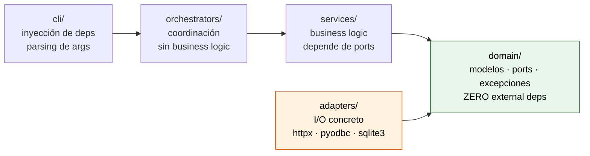

# Arquitectura hexagonal: por qué cada capa y qué puede importar a qué

> [← Volver al índice](../INDEX.md) · [Explanation](README.md)

## El problema que estamos resolviendo

CMCourier es una reescritura. El proyecto anterior, `RVIMigration`, era un único archivo `pipeline.py` de **1341 líneas** que mezclaba en el mismo método: queries a AS400 por ODBC, escrituras a SQLite, llamadas HTTP a CMIS, ensamblado de PDFs, configuración de threads y reglas de negocio sobre el modelo documental del banco. Funcionó hasta que dejó de funcionar — y cuando dejó de funcionar, **no había forma de testear nada** sin levantar toda la infraestructura corporativa.

La constitución del proyecto (Principio I) prohíbe que vuelva a pasar. La forma de prohibirlo no es escribir un manifesto — es **fijar la dirección de las dependencias** y dejar que el compilador (en nuestro caso, `mypy --strict`) sea el guardia.

## La regla, en una imagen



Las flechas marcan **quién puede importar a quién**. Lo que no aparece como flecha está prohibido. En particular:

- `services/` **no puede** importar `adapters/`. Si un servicio necesita hacer HTTP, lo hace contra un `IUploader` (port), no contra `httpx`.
- `domain/` **no puede** importar nada que no sea la standard library de Python. Ni `pydantic`, ni `httpx`, ni `pandas`. Nada.
- `orchestrators/` puede importar `services/` y `domain/`, pero **no `adapters/`** directamente — los recibe ya construidos por la CLI.
- `cli/` es el único lugar donde se permite instanciar adapters concretos (`CmisUploader(...)`, `SQLiteTrackingStore(...)`) y pasarlos hacia abajo por composición.

## ¿Por qué cada capa existe?

### `domain/` — el corazón puro

Acá viven tres cosas, y solo tres:

1. **Modelos** (`domain/models.py`): dataclasses inmutables que representan conceptos del problema — `Trigger`, `RVABREPDocument`, `StagedFile`, `ResolvedMetadata`, `MigrationRecord`. Son datos, no comportamiento.
2. **Ports** (`domain/ports.py`): clases abstractas que definen contratos de I/O — `IDataSource`, `ITrackingStore`, `IUploader`, `IAssembler`, `S0Strategy`, `IDocumentCache`. Cada port es la frontera entre "lo que el dominio necesita" y "cómo el mundo real lo provee".
3. **Excepciones** (`domain/exceptions.py`): la jerarquía completa de errores tipados, desde `CMCourierError` (raíz) hacia abajo. Cada excepción carga su contexto en `self.context` y se puede serializar.

La regla **"zero external deps"** no es un capricho estético. Es lo que te permite:

- **Testear el dominio en milisegundos**, sin spinear nada. Un test unit puede instanciar un `ClientTrigger`, pasarlo a un servicio con un mock de `IDataSource`, y verificar el resultado — todo en menos de 1 ms, sin tocar disco ni red.
- **Cambiar adaptadores sin tocar lógica**. Cuando migramos de `requests` a `httpx[http2]` (spec 060), el `IUploader` no se movió. Solo cambiamos el adapter concreto. Cero cambios en servicios, cero cambios en tests unit.
- **Hacer cumplir el principio con tooling**. `mypy --strict` configurado sobre `domain/` rechaza cualquier import "fancy". Si alguien intenta `from pydantic import BaseModel` adentro de un modelo de dominio, falla la CI antes del review.

### `adapters/` — donde vive el I/O

Cada port abstracto tiene **N implementaciones concretas** acá. Por ejemplo `IDataSource`:

- `adapters/sources/tabular.py` (CSV via pandas)
- `adapters/sources/as400.py` (ODBC via pyodbc)

Y `ITrackingStore`:

- `adapters/tracking/sqlite.py` (WAL mode, writer thread, queue-batched)
- `adapters/tracking/as400_niarvilog.py` (sincronización distribuida con AS400)

Esto es **el único lugar** del codebase donde se permite tocar red, disco o base de datos. Si encontrás un `open(...)`, un `requests.get(...)` o un `cursor.execute(...)` fuera de `adapters/`, eso es un bug — abrí un PR para refactorearlo a través de un port.

### `services/` — la lógica de negocio

Servicios como `IndexingService`, `MappingService`, `MetadataService` reciben **ports** en su constructor, no adapters. Por ejemplo:

```python
class MetadataService:
    def __init__(self, sources: Mapping[str, IDataSource], ...):
        ...
```

El servicio no sabe ni le importa si `sources["clientes"]` está leyendo un CSV o haciendo `SELECT * FROM CLIENTES` por ODBC. Solo sabe que tiene una `IDataSource` y puede llamar `get_by_fields(...)`.

¿Por qué? Porque la lógica de negocio (la cascada de resolución de metadatos, el modelo documental, las reglas de mapeo RVI→CM) **no depende del medio**. Es la misma lógica si la fuente es un Excel exportado o la base de producción. Y eso es lo que la hace testeable y portable.

### `orchestrators/` — la coreografía

Acá vive `StagedPipeline` (que corre S0→S7 secuencial), `MultiBatchOrchestrator` (que solapa N chunks de prep y upload), `StreamingOrchestrator` (que monta el bucket entre productor y consumidor). Coordinan, miden, manejan errores. **No deciden qué hacer con un documento** — eso es lógica, vive en `services/`. **No hacen I/O** — eso es adapter.

Un orchestrator decente se lee como un guión: "primero `S0Strategy.acquire` para conseguir triggers, después `IndexingService.process` por cada trigger, después `MappingService.map`, después...". Si te encontrás un orchestrator con un `if response.status_code == 429: time.sleep(2)`, eso es **lógica de retry y va en el adapter** (o en un service auxiliar).

### `cli/` — la inyección de dependencias

La CLI es el techo de la pirámide y el único que conoce a todos. Lee el YAML, construye los adapters concretos (`SQLiteTrackingStore`, `CmisUploader`, `As400DataSource`), los inyecta en los servicios, los pasa al orchestrator, arranca la corrida.

Toda la "wiring" pesada vive en `config/wiring.py`. Cuando un nuevo flag de CLI necesita un nuevo adapter, este es el único lugar que crece — el resto del codebase ni se entera.

## Cómo se aplica en la práctica

Hay tres olores que indican que estás violando el principio. Si te encontrás con cualquiera, **stop, refactor**:

### 1. Importando un módulo "concreto" desde un servicio

```python
# services/upload_helper.py — MAL
import httpx  # ⛔ services no toca httpx

def upload_with_retry(url: str, file: Path) -> str:
    response = httpx.post(url, files={"file": file.open("rb")})
    ...
```

La fix es introducir un port (`IUploader`) y mover la implementación al adapter. El servicio recibe un `IUploader` y lo usa.

### 2. Instanciando un adapter adentro de un servicio

```python
# services/metadata.py — MAL
from cmcourier.adapters.sources.as400 import As400DataSource  # ⛔

class MetadataService:
    def __init__(self):
        self.source = As400DataSource(...)  # ⛔ acoplamiento dur
```

La fix es pedir el `IDataSource` por constructor. La CLI decide cuál pasarle.

### 3. Importando algo no-stdlib desde `domain/`

```python
# domain/models.py — MAL
from pydantic import BaseModel  # ⛔

class Trigger(BaseModel):  # ⛔
    ...
```

`pydantic` vive en `config/` para validar el YAML. El dominio usa `@dataclass(frozen=True, slots=True)` y nada más.

## Lo que esta arquitectura te compra

Esta separación no es decorativa. Te compra cosas concretas:

- **Tests unit que corren en < 30 segundos**. La suite completa de unit (que mockea ports) está debajo de ese umbral por construcción. Si un test unit se vuelve lento, casi seguro es porque tocó un adapter por accidente.
- **AS400 no se mockea jamás**. Principio VI: el `CSVDataSource` adapter implementa el mismo `IDataSource` port. Cuando querés ejercitar la lógica de metadata, le pasás CSVs. Cuando querés ejercitar el adapter de AS400, vas a staging contra el iSeries real. Mockear pyodbc sería testear el mock — inútil.
- **Reemplazo de tracking store sin tocar nada de pipeline**. Si mañana queremos mover el tracking a PostgreSQL, escribimos `PostgresTrackingStore(ITrackingStore)`, agregamos un branch en la wiring, y listo. Cero líneas movidas en servicios/orchestrators.
- **El "circular import" estructural es imposible**. La dirección de dependencia es un DAG estricto. Si Python te tira `ImportError: circular import`, eso es un bug arquitectónico — alguien está importando "para arriba".

## ¿Qué hay del principio "no God Objects"?

El Principio III complementa al I. La arquitectura te separa por **capas**; el SRP te separa por **responsabilidades** dentro de cada capa. Las dos reglas son independientes:

- Tenés un servicio que respeta el hexágono pero tiene 1200 líneas y mezcla mapping + metadata + assembly. Eso es God Object adentro de la capa correcta. **Mal.**
- Tenés un servicio chico, bien decompuesto, pero hace `import httpx` directamente. Eso es violación del hexágono. **Mal.**

Las dos hay que respetarlas. La constitución pone un cap **duro** de 50 líneas por función (Principio III) y **soft tripwires** de 400 líneas por archivo, 200 por clase. Cuando los excedés, la pregunta es: "¿esta complejidad la trajo el dominio (legítima) o la inventé yo (refactorear)?".

## Ver también

- [`pipeline-stages.md`](pipeline-stages.md) — qué hace cada stage adentro de la pipeline coordinada por el orchestrator
- [`idempotency-and-retries.md`](idempotency-and-retries.md) — cómo se aplica el Principio II atravesando todas las capas
- [`.specify/memory/constitution.md`](../../.specify/memory/constitution.md) — los 9 principios en su versión normativa
- la spec de dominio del proyecto — el "qué" del problema que esta arquitectura organiza
