# Bandwidth honesty: por qué distribuimos bytes sobre la transmisión real

> [← Volver al índice](../INDEX.md) · [Explanation](README.md)

## El problema que estamos resolviendo

El sampler de bandwidth alimenta el chart del TUI: la sparkline que muestra "MB/s en los últimos 60 segundos" y los indicadores `current_mbps` y `peak_mbps`. Si esos números mienten, todas las decisiones operativas que tomes a partir de mirarlos van a ser malas.

Pre-069 (spec 069), el sampler **mentía sistemáticamente**. No por bug en el sentido clásico — la cuenta era "correcta" matemáticamente — pero el shape de los números era engañoso. Esta es la historia del bug y del fix.

## El sampler pre-069: completion aliasing

El contrato original era simple:

```python
def record_upload(size_bytes: int, completed_at: float) -> None:
    bucket_ts = int(completed_at)
    self._buckets[bucket_ts] += size_bytes
```

Cuando un upload terminaba, el sampler tomaba `completed_at` (timestamp wall-clock), truncaba al segundo entero, y le sumaba **todo el tamaño del archivo** a ese bucket de un segundo.

Bucket de 1 segundo = "MB/s para ese segundo". 60 buckets rolling = un minuto de historia para la sparkline. Hasta ahí, todo bien.

### El bug en escenario realista

Imaginá un upload de **30 MB que tarda 3 segundos**:

- Arranca en `t=10.5` (timestamp wall-clock).
- Termina en `t=13.5`.
- Durante esos 3 segundos, el archivo está **activamente transmitiendo** — el throughput sostenido es 10 MB/s.

Con el sampler pre-069:

```
bucket[10] = 0
bucket[11] = 0
bucket[12] = 0
bucket[13] = 30_000_000   ← todos los 30 MB al segundo de completion
```

`current_mbps()` lee el bucket más reciente completo: en `t=14` mira `bucket[13]` y reporta **30 MB/s**.

Pero un segundo después, en `t=15`, mira `bucket[14]` que está vacío (ninguna otra completion en ese segundo). Reporta **0 MB/s**.

```
TUI:  t=14:  current: 30 MB/s   ← spike
TUI:  t=15:  current:  0 MB/s   ← valley
TUI:  t=16:  current: 25 MB/s   ← otro spike (otra completion)
TUI:  t=17:  current:  0 MB/s
```

La sparkline parecía dientes de sierra. El operador veía picos y ceros y concluía: "la red se está cayendo intermitentemente". Pero la realidad era que la red estaba sostenida a 10 MB/s. **El sampler estaba aliaseando los bytes al evento discreto de completion**.

### Por qué `peak_mbps` también estaba inflado

`peak_mbps()` devolvía `max(bucket.values())` — el máximo histórico de los 60 buckets. Como cada completion grande inflaba su bucket de un segundo, el peak reportado era equivalente a "el archivo más grande que se completó dividido por 1 segundo". Para un archivo de 30 MB completando "en un segundo" (aunque tardara 3), `peak = 30 MB/s` — aunque el throughput sostenido nunca llegara a esa marca.

Para el operador: "el peak fue 30 MB/s, eso es bueno". Para la realidad: "el throughput sostenido fue 10 MB/s, el peak nominal es un artifact".

## El fix de 069: distribuir uniformemente

Spec 069 cambió la firma:

```python
def record_upload(size_bytes: int, *, started_at: float, completed_at: float) -> None:
```

El sampler ahora **conoce la ventana de transmisión** (`[started_at, completed_at]`) y distribuye los bytes uniformemente sobre los segundos que esa ventana toca.

### El algoritmo

Para un upload de 30 MB de `t=10.5` a `t=13.5` (duración 3 s):

1. `bytes_per_s = 30_000_000 / 3.0 = 10_000_000` (10 MB/s).
2. Para cada bucket entero entre `int(10.5) = 10` y `int(13.5) = 13`:
   - `overlap = min(completed_at, bucket+1) - max(started_at, bucket)`
   - `bytes_in_bucket = bytes_per_s × overlap`

Cuenta segundo por segundo:

| Bucket | Inicio | Fin | Overlap | Bytes acreditados |
|--------|--------|-----|---------|---------------------|
| 10 | max(10.5, 10) = 10.5 | min(13.5, 11) = 11 | 0.5 | 0.5 × 10 MB/s = **5 MB** |
| 11 | max(10.5, 11) = 11 | min(13.5, 12) = 12 | 1.0 | 1.0 × 10 MB/s = **10 MB** |
| 12 | max(10.5, 12) = 12 | min(13.5, 13) = 13 | 1.0 | 1.0 × 10 MB/s = **10 MB** |
| 13 | max(10.5, 13) = 13 | min(13.5, 14) = 13.5 | 0.5 | 0.5 × 10 MB/s = **5 MB** |
| **Total** | | | **3.0** | **30 MB** ✓ |

La suma da exactamente 30 MB — no perdemos ni inflamos bytes. La distribución refleja la transmisión real.

```mermaid
gantt
    title Upload de 30 MB de t=10.5 a t=13.5
    dateFormat X
    axisFormat %s

    section Transmisión
    Upload activo: 10.5, 13.5

    section Buckets
    bucket 10 (5 MB):  10, 11
    bucket 11 (10 MB): 11, 12
    bucket 12 (10 MB): 12, 13
    bucket 13 (5 MB):  13, 14
```



`current_mbps()` ahora mira `bucket[13]` (5 MB) y reporta **5 MB/s** durante el último segundo (que solo tocaba la mitad del upload). Mirando los buckets 11 y 12 reporta **10 MB/s** sostenido. La sparkline ahora es plana en 10 MB/s durante los segundos centrales y baja en los bordes — fiel a la realidad.

## Cómo lo emite el upload event

El `_BandwidthHandler` (un `logging.Handler`) escucha records con `kind="cmis_upload"`. Para derivar `started_at`, lee `duration_ms` del LogRecord (que `CmisUploader._emit_network` siempre setea):

```python
completed_at = float(record.created)  # timestamp wall-clock del record
duration_ms = getattr(record, "duration_ms", 0.0) or 0.0
duration_s = float(duration_ms) / 1000.0
started_at = completed_at - max(0.0, duration_s)

self._sampler.record_upload(
    int(size_bytes),
    started_at=started_at,
    completed_at=completed_at,
)
```

Tres notas operativas:

- **Defensive fallback**: si `duration_ms` falta o es cero, el handler asume duración cero, y el sampler acredita todo al bucket de completion (shape pre-069). Esto preserva el comportamiento legacy para records mal formados — no perdemos bytes, simplemente perdemos la distribución.
- **`duration_ms` es la duración del intento exitoso**, no incluye los retries. Si un upload hizo 2 retries y el tercero exitoso tomó 1 segundo, distribuimos los bytes sobre ese 1 segundo. Operativamente correcto: los bytes que llegaron al server llegaron en ese 1 segundo.
- **El cumulative counter no cambia**. `_cumulative_bytes` sigue siendo `+= size_bytes` por completion. La suma total a lo largo de la corrida es la misma; solo cambia cómo se distribuye sobre los buckets rolling.

## La sutileza: tasa sostenida vs ráfaga real

El sampler asume que **la tasa de transmisión es constante durante el upload**. Para HTTP/1.1 sobre TCP con flow control estable, eso es una buena aproximación. Para HTTP/2 con multiplexing (varios uploads compartiendo una conexión), la tasa real fluctúa más — el sampler suaviza esas fluctuaciones internas.

¿Es problema? No realmente, por dos razones:

1. **La granularidad del sampler es de 1 segundo**. No podemos reportar a sub-segundo aunque quisiéramos. Las fluctuaciones intra-segundo se perderían igual.
2. **El agregado es correcto**. Si tres uploads simultáneos comparten 10 MB/s de banda, cada uno reporta su porción y la suma da 10 MB/s. El operador ve la suma, que es lo que le importa.

La asunción de tasa constante es lo correcto al nivel de modelado.

## ¿Y los uploads sub-segundo?

¿Qué pasa con un upload de 50 KB que tarda 80 ms? `started_at = 12.42`, `completed_at = 12.5`. Ambos truncan al mismo bucket `12`:

```python
for ts in range(int(12.42), int(12.5) + 1):  # solo 12
    overlap = min(12.5, 13) - max(12.42, 12)  # = 0.08
    bytes_in_bucket = bytes_per_s * overlap  # = (50_000 / 0.08) * 0.08 = 50_000
```

Todo el upload va al bucket 12. Es equivalente al shape pre-069 para uploads sub-segundo, lo cual es correcto — no hay "transmisión sostenida" que distribuir, fue una ráfaga corta.

## El impacto operativo

Post-069, el operador puede confiar en el chart de bandwidth. Cuando AIMD escala el pool y la sparkline sube de "promedio 8 MB/s" a "promedio 25 MB/s", eso es **real**. Cuando aparece un valle de 5 MB/s, **es real** (significa que CMIS está respondiendo lento o que la red entre prep_workers y consumers se desbalanceó). Las decisiones de tuning ahora se basan en una señal honesta.

Pre-069, comparar dos corridas era irrealizable: la corrida con archivos chicos (uploads sub-segundo) reportaba un peak honesto; la corrida con archivos grandes reportaba peaks fantasma de "todo en 1 segundo". No se podía comparar.

## Por qué esto es importante para AIMD

AIMD no usa el bandwidth como señal — usa p95 de latencia. **Pero el operador sí mira el bandwidth para decidir si AIMD está haciendo bien su trabajo**.

Pre-069, un operador podía concluir "AIMD está malísimo, oscila entre 30 y 0 MB/s" cuando en realidad AIMD estaba estable y solo el sampler reportaba mal. Post-069, cuando ves un valle real, sabés que es real, y podés actuar (subir `min_threads`, ajustar `halve_threshold_ratio`, etc.).

La honestidad del sampler **habilita el debug del controlador**. Sin ella, debuggear AIMD es como debuggear con un debugger que miente.

## El cambio fue chico

El fix vivió en dos archivos:

- `observability/metrics.py` — `_BandwidthSampler.record_upload` cambió de firma y body. `_BandwidthHandler.emit` empezó a derivar `started_at` de `duration_ms`.
- Un test unit (`tests/unit/tui/test_data_provider.py`) que llamaba directo al sampler con la firma vieja se actualizó.

Cero cambios en el `CmisUploader` (el `duration_ms` ya lo emitía). Cero cambios en el resto del pipeline. Es el tipo de fix que aparenta cosmético desde afuera pero arregla un problema sistémico de la observabilidad.

## Resumen

| Aspecto | Pre-069 | Post-069 |
|---------|---------|----------|
| Firma | `record_upload(size, completed_at)` | `record_upload(size, *, started_at, completed_at)` |
| Modelo | Todos los bytes al segundo de completion | Bytes distribuidos uniformemente sobre `[started_at, completed_at]` |
| `current_mbps` | Aliaseaba sobre eventos de completion | Tasa sostenida real |
| `peak_mbps` | Inflado por completions concentradas | Cap en la tasa sostenida real |
| Cumulative bytes | Igual | Igual |
| Source de duration | N/A | `duration_ms` del log record (siempre presente para `cmis_upload`) |
| Fallback | N/A | Si falta `duration_ms`, shape pre-069 (defensivo) |

## Ver también

- [`aimd-auto-tuning.md`](aimd-auto-tuning.md) — el controlador que el operador debuggea mirando bandwidth
- [`pipeline-stages.md`](pipeline-stages.md) — S5 es lo que el sampler observa
- `src/cmcourier/observability/metrics.py` — la implementación (`_BandwidthSampler` y `_BandwidthHandler`)
- `specs/069-bandwidth-sampler-window/` — la spec con la motivación operativa
