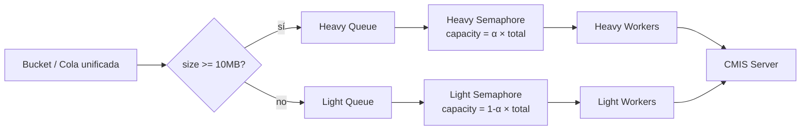

# Heavy/Light lanes: por qué dividir S5 en dos canales

> [← Volver al índice](../INDEX.md) · [Explanation](README.md)

## El problema que estamos resolviendo

En una corrida con archivos de tamaños mixtos, S5 sufre de un problema clásico: **un upload gigante bloquea workers que podrían estar despachando trabajo chico**. Pensá en el escenario:

- `cmis.workers: 16`.
- Cola de 5000 docs: 4900 pesan < 1 MB cada uno, 100 pesan 20–40 MB cada uno.
- Sin ninguna política, los 16 workers toman los primeros 16 docs de la cola en el orden que vinieron de los productores. Si vienen primero 16 archivos de 30 MB, **los 16 workers están ocupados ~60 segundos** subiendo eso. Mientras tanto, miles de archivos chicos esperan atrás haciendo nada.

Visualmente:

```
Worker 1: [████████████████████ 30MB doc] 
Worker 2: [████████████████████ 28MB doc] 
Worker 3: [████████████████████ 25MB doc] 
...
Worker 16:[████████████████████ 22MB doc]
Cola: [▫][▫][▫][▫][▫][▫]... 4984 chicos esperan
```

Eso es **head-of-line blocking** clásico. La solución es dividir el tráfico en dos clases (heavy y light) y darle a cada una su propio share de workers, para que los archivos chicos nunca queden atrás de uno gigante.

## El concepto: dos lanes que comparten budget

Spec 036 (Heavy/Light Lanes) introdujo el patrón. La idea:

- Definí un threshold de tamaño (`heavy_threshold_bytes`, default **10 MB**).
- Items con `size_bytes >= threshold` van al lane **HEAVY**.
- Items con `size_bytes < threshold` van al lane **LIGHT**.
- Cada lane tiene su propio `ResizableSemaphore` (un semáforo cuya capacidad puede cambiar en runtime).
- Los dos semáforos comparten el **budget total** que viene de AIMD: `heavy_capacity + light_capacity == aimd_total`.



El split inicial lo controla `heavy_initial_ratio` (default 0.2 → 20% del budget para heavy). Con `total: 16`, eso es 3 heavy + 13 light.

## El rebalance: cuando un lane se queda sin trabajo

El split fijo no funciona bien en todos los escenarios. Imaginá que tu corrida tiene 90% docs chicos y 10% docs grandes. El lane heavy procesa sus docs y se queda **sin cola**. Sus 3 workers están idle mientras el lane light sigue con 4000 docs esperando.

Acá entra el **rebalance heurístico** del `LaneController` (`services/lane_controller.py`):

1. Cada vez que se actualiza la profundidad de la queue de un lane, el controller registra:
   - Si pasó a `> 0`: borra el sello "first empty" — el lane tiene trabajo.
   - Si pasó a `0`: estampa `_*_first_empty_at = now` — el lane está drenado.

2. Un daemon thread llamado `cmcourier-lane-rebalance` corre cada `rebalance_interval_s` (default 10 s).

3. En cada tick, mira: "¿alguno de los dos lanes lleva más de `idle_threshold_s` (default 15 s) drenado?".

4. Si sí, **migra TODA su capacidad al otro lane**, dejando el `floor` de 1 worker (mínimo del `ResizableSemaphore`).

```python
# Esquema del rebalance_tick (lane_controller.py)
if heavy_idle_s >= idle_threshold_s and heavy_cap > 1:
    new_heavy = 1
    new_light = total  # el restante
elif light_idle_s >= idle_threshold_s and light_cap > 1:
    new_light = 1
    new_heavy = total
```

¿Por qué dejar 1 worker como floor? Porque el `ResizableSemaphore` exige `max(1, n)` y porque si un trigger heavy aparece **después** de la migración (caso poco común pero posible cuando los productores siguen activos), no querés que el lane esté en `0` y el item se quede esperando para siempre.

## El AIMD por encima

Hay dos niveles de control y conviene tenerlos claros:

1. **AIMD** decide cuál es el **budget total** de workers (`cmis.workers + N - M`). No sabe ni le importa que existan lanes. Lee p95 de S5 (agregado) y hace resize.

2. **LaneController** recibe `set_total_budget(new_total)` y redistribuye proporcionalmente preservando el ratio actual:

```python
ratio = heavy_cap / current_total
new_heavy = max(1, round(new_total * ratio))
new_heavy = min(new_heavy, new_total - 1)  # garantía: light tiene al menos 1
new_light = new_total - new_heavy
```

Entonces si AIMD escala de 16 a 32 con un split actual 4 (heavy) + 12 (light) = ratio 0.25:

- `new_heavy = round(32 × 0.25) = 8`
- `new_light = 32 - 8 = 24`

El ratio se preserva. La distribución solo cambia por:
- Migraciones del rebalance (cuando un lane lleva mucho idle).
- Operaciones `set_total_budget` de AIMD (preservando ratio).

## El bug histórico: el caso de los dos `LaneController`

Spec 070 fixea un bug que vivía silencioso en streaming + lanes. Vale la pena explicarlo porque ilustra cómo bugs de **diseño** atraviesan implementaciones aparentemente correctas.

### El setup pre-070

En modo **batched**, `StagedPipeline.__init__` (de spec 036) construía el `LaneController` y lo guardaba en `self.lane_controller`. El TUI tenía un `TUIDataProvider` que leía `pipeline.lane_controller.snapshot()` para renderizar el bloque LANES.

Cuando spec 065 (heavy/light lanes en streaming) shippeó, el `StreamingOrchestrator.__init__` también construía un `LaneController` y lo guardaba en `self._lane_controller`. El dispatcher y los consumers del modo streaming **escribían a ese segundo controller**: `set_queue_depth(...)`, `acquire(...)`, etc.

### El bug

Cuando corrías streaming + lanes, había **dos `LaneController` vivos** simultáneamente:

- El del `StagedPipeline` (construido por 036, **nunca recibía actualizaciones**).
- El del `StreamingOrchestrator` (construido por 065, recibía toda la actividad real).

El TUI leía `pipeline.lane_controller.snapshot()` — leía el **muerto**. Resultado:

- UPLOAD tab → bloque LANES → `queue 0` para HEAVY y `queue 0` para LIGHT. **Siempre**. Nunca cambia.
- BUCKET tab → bloque LANES (que leía del controller del streaming orch) → datos correctos. Cualquier cambio.

Visualmente eran dos versiones distintas de la verdad en dos tabs distintos. El operador reportó: "el UPLOAD tab dice queue 0 todo el run pero el BUCKET tab muestra valores reales".

Peor todavía: AIMD llamaba `pipeline._on_pool_resize → pipeline.lane_controller.set_total_budget(new_total)` — estaba seteando el budget en el controller **muerto**. El controller vivo (en streaming) nunca se enteraba de que AIMD había decidido escalar. **El AIMD-driven lane rebalance estaba roto en silencio desde 065 hasta 070**.

### El fix

070 unificó: el `StreamingOrchestrator` ya **no construye un `LaneController`**. Tiene una `@property lane_controller` que **forwardea** a `self._pipeline.lane_controller`:

```python
@property
def lane_controller(self) -> LaneController | None:
    return self._pipeline.lane_controller

@property
def _lane_controller(self) -> LaneController | None:
    """070: alias interno read-through para que los call sites
    legacy no necesiten cambiar."""
    return self._pipeline.lane_controller
```

Cero cambios en los call sites (`self._lane_controller.start()`, `.set_queue_depth(...)`, etc.) — Python property forwarding hace su magia. Una sola fuente de verdad. AIMD apunta al controller correcto. El TUI lee del mismo controller que escribe el dispatcher.

### La lección

Este bug es interesante por dos razones:

1. **Era invisible**. Cada parte funcionaba bien por separado. La construcción del controller no fallaba. Los snapshots no devolvían errores. Simplemente, dos lugares construían instancias separadas y nadie había codificado que **debía haber exactamente una**.

2. **Es el patrón clásico de "feature flag desincroniza estado"**. 036 asumió que el controller vivía en `StagedPipeline` (porque era el dueño en batched). 065 asumió que tenía que crear el suyo (porque streaming era distinto). Sin coordinación explícita, las dos suposiciones convivieron.

La fix arquitectónica era: **declarar de entrada que el controller es propiedad del pipeline**, no del orchestrator. Eso es lo que 070 codifica.

## La activación: cuándo conviene encender lanes

Las lanes están **off por default** (`enabled: false`). Encender solo cuando:

1. Tu dataset tiene **varianza alta de tamaño**. Mezcla de < 1 MB y > 10 MB. Si todo es uniformemente chico o uniformemente grande, no hay head-of-line blocking que resolver — el split te agrega complejidad sin beneficio.

2. Tenés **al menos `heavy_lane_min_batch` docs** (default 50). Con menos, el lane heavy va a tener tan pocos items que no justifica un pool separado.

3. Querés **prioridad operativa para los chicos**: que el bandwidth aggregate esté alto rápido. Las lanes garantizan que los archivos chicos no se bloquean atrás de los grandes.

Si encendés lanes y mirás el TUI, vas a ver el bloque LANES en el UPLOAD tab (y BUCKET tab en streaming) con:

- `HEAVY` y `LIGHT` cada uno con su `pool`, `busy`, `queue depth`.
- `total_budget` que viene de AIMD.

Cuando AIMD escala, los dos números se ajustan proporcionalmente. Cuando un lane se drena, vas a ver eventos `lane_rebalance` en el log (en español: "lane rebalance: heavy -> other" o "lane rebalance: light -> other") y los caps cambian.

## Configuración completa

```yaml
processing:
  heavy_light_lanes:
    enabled: true
    heavy_threshold_bytes: 10485760   # 10 MB
    heavy_lane_min_batch: 50          # mínimo para activar
    heavy_initial_ratio: 0.2          # 20% al heavy inicialmente
    rebalance_interval_s: 10.0        # cuánto chequea el daemon
    idle_threshold_s: 15.0            # cuánto tiene que estar drenado para migrar
```

Tunables relevantes:

- `heavy_threshold_bytes`: ¿qué tamaño consideramos "grande"? 10 MB es un compromiso entre "raro pero costoso" y "frecuente pero medio". Bajar a 5 MB hace heavy más popoulado; subir a 20 MB lo hace más exclusivo.
- `heavy_initial_ratio`: ¿qué fracción del budget arranca heavy? 0.2 asume que la **mayoría** del trabajo es chico. Si tu mix es 50/50 en cantidad, subí a 0.4 o 0.5.
- `idle_threshold_s`: cuánto esperar antes de migrar. Más bajo = más reactivo, pero también más chance de migrar por un lull transitorio. 15 s es el default conservador.

## Lo que NO hacen las lanes

- **No reordenan el tráfico**. Si el orden de los productores es "10 heavy, 10 light, 10 heavy, 10 light", el split los manda al lane correcto pero respeta el orden de llegada **dentro** de cada lane.
- **No garantizan fairness perfecta**. Si los heavy tardan 10× más, los light van a despachar 10× más items en el mismo wall-clock — pero eso es lo que querés, los light son operativamente más urgentes.
- **No reemplazan el AIMD**. El budget total sigue siendo gobernado por AIMD. Las lanes solo lo redistribuyen.
- **No serializan con el bucket**. En streaming, el bucket principal sigue siendo único; un dispatcher saca de él y divide en las dos sub-colas. Los productores no saben que existen lanes.

## Ver también

- [`aimd-auto-tuning.md`](aimd-auto-tuning.md) — el controlador del budget total
- [`the-bucket-pattern.md`](the-bucket-pattern.md) — cómo el dispatcher entra entre bucket y consumers en streaming
- [`streaming-vs-batched.md`](streaming-vs-batched.md) — ambos modos soportan lanes, pero con shapes distintos
- `src/cmcourier/services/lane_controller.py` — 276 líneas con la implementación
- `specs/065-streaming-heavy-light-lanes/` y `specs/070-unify-lane-controller/` — las specs de la integración con streaming y la unificación
