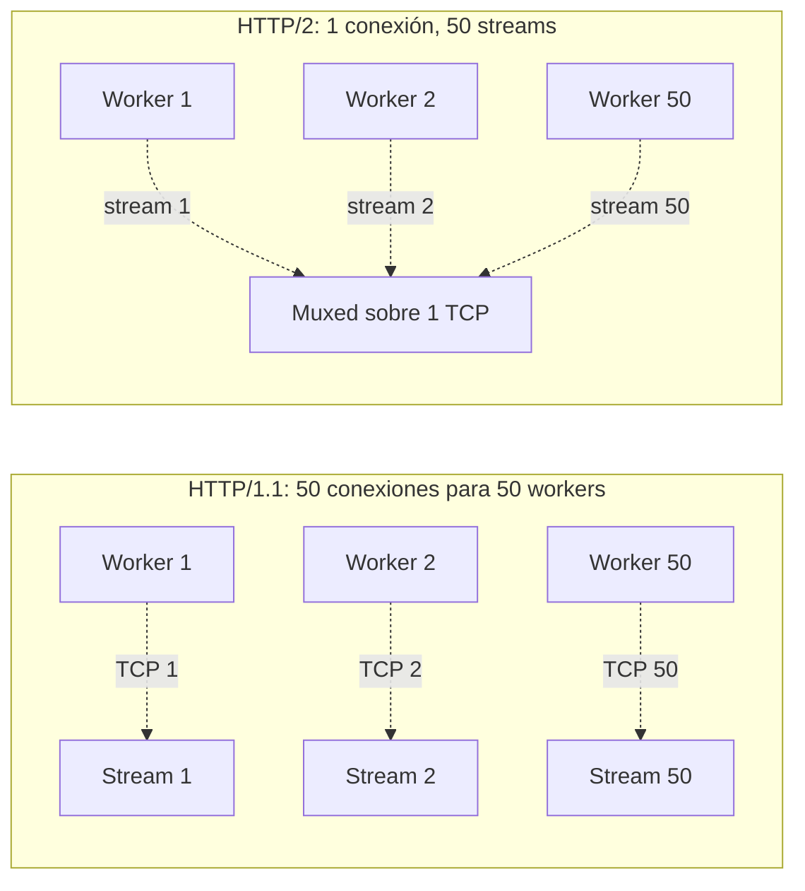

# HTTP/2 multiplexing: por qué `httpx[http2]` y no `requests`

> [← Volver al índice](../INDEX.md) · [Explanation](README.md)

## El problema que estamos resolviendo

S5 sube documentos al CMIS Browser Binding. Con `cmis.workers: 16` (típico) y AIMD escalando hasta `max_threads: 50`, en un instante puede haber **50 uploads simultáneos** desde nuestro proceso a un solo endpoint CMIS.

¿Eso es 50 conexiones TCP separadas? Con HTTP/1.1 sí. Con HTTP/2, **no**.

Spec 060 migró del cliente `requests` (HTTP/1.1 only) a `httpx[http2]`. El cambio parece cosmético — la API de uso es casi idéntica — pero las implicancias en términos de **costo de red** son significativas, sobre todo en cargas con uploads chicos.

## HTTP/1.1: una conexión por request en vuelo

En HTTP/1.1, cada conexión TCP solo puede transmitir **una request a la vez**. Si querés enviar 50 requests en paralelo, necesitás 50 conexiones TCP separadas. Con keep-alive, cada conexión se puede reutilizar para una **siguiente** request, pero solo serialmente.

Para CMCourier con 50 workers en S5 y HTTP/1.1, eso significa:

1. **50 conexiones TCP abiertas** simultáneamente contra el server CMIS.
2. **50 handshakes TLS** (porque CMIS típicamente está detrás de HTTPS).
3. **50 warmups de JSESSIONID** (CMIS Browser Binding setea una cookie de sesión por conexión).
4. **El server CMIS** mantiene 50 sockets abiertos, 50 buffers, 50 worker threads de su lado.

El handshake TLS es el costo grande. Un handshake completo (RSA con sesión nueva) toma 100–300 ms, dominado por dos roundtrips de red. Con TLS resumption (session ID o tickets) baja a 1 roundtrip (~50 ms), pero igual es overhead que pagás **por conexión**.

Spec 038 mitigó esto pre-cargando el pool de keep-alive con el `warm_upload_pool` que dispara N handshakes al startup, antes de que la primera request "real" pague el costo en el critical path. Pero seguís teniendo N conexiones físicas para N concurrencia.

## HTTP/2: multiplexing sobre una sola conexión

HTTP/2 cambia el modelo. Sobre **una sola conexión TCP**, podés tener **N streams concurrentes**, cada uno con su propia request y response. El protocolo enmarca los frames de cada stream y los intercala sobre el mismo socket.

Con HTTP/2 y 50 workers:

1. **Una sola conexión TCP** entre CMCourier y CMIS.
2. **Un solo handshake TLS** al startup.
3. **Un JSESSIONID** que viaja en todas las requests.
4. **El server CMIS** mantiene un socket abierto.

El ahorro es claro para cargas con uploads chicos (donde el handshake/setup era una fracción significativa del wall-clock). Para uploads grandes, el dominio es el transfer del cuerpo y la diferencia es menor — pero todavía a favor de HTTP/2 por menor pressure de file descriptors y memory en el server.

## El requisito: ALPN

HTTP/2 sobre HTTPS requiere **ALPN** (Application-Layer Protocol Negotiation), una extensión de TLS donde el cliente declara "puedo hablar HTTP/2" en el ClientHello y el server responde "ok, hablemos HTTP/2" en el ServerHello. La negociación ocurre **dentro del handshake TLS**, sin roundtrips adicionales.

Si el server soporta HTTP/2 y ALPN: la conexión termina como HTTP/2. Multiplexing real.

Si el server **no** soporta HTTP/2 (o ALPN está deshabilitado, o el ALPN responde HTTP/1.1): `httpx` cae transparentemente a HTTP/1.1. Cero cambios de código. La misma API funciona, los mismos retries, el mismo upload streaming. Simplemente perdés el multiplexing.

En la realidad de CMCourier:

- **Alfresco con Apache adelante** en producción: habla HTTP/2 vía ALPN. Multiplexing activo.
- **Alfresco con Tomcat directo** en staging (sin reverse proxy con HTTP/2): habla HTTP/1.1. `httpx` lo detecta vía ALPN failure y cae sin drama.

`httpx[http2]` te da HTTP/2 cuando está disponible y HTTP/1.1 cuando no. No tenés que codear branches.

## La implicancia operativa: "workers" no es "conexiones"

Esto es importante para el tuning. Cuando AIMD escala el pool a 30 workers:

- **En HTTP/1.1**: hay (potencialmente) 30 conexiones TCP físicas. El kernel tiene 30 sockets, 30 buffers send/recv, 30 entries en su tabla de conntrack si hay un firewall en el medio.
- **En HTTP/2**: hay 1 conexión TCP. Los "30 workers" son 30 streams adentro de esa única conexión.

Para el server CMIS, la diferencia es similar — un solo file descriptor en HTTP/2 (con 30 streams adentro) vs 30 sockets en HTTP/1.1.

¿Significa eso que con HTTP/2 podés escalar el pool sin límite? **No**. El cuello de botella se mueve:

- **CPU del cliente** para gestionar streams (relativamente barato — httpx lo hace en C++ internamente vía `h2`).
- **Window size de flow control** de HTTP/2. Cada stream tiene una window inicial; cuando se llena, el stream se bloquea hasta que el server mande WINDOW_UPDATE. Si vos sobrecargás con muchos streams concurrentes, el window se vuelve el limitante.
- **CPU del server** para procesar los uploads en paralelo — esto no cambia entre HTTP/1.1 y HTTP/2.

En la práctica, el techo efectivo de uploads concurrentes contra Alfresco con HTTP/2 es **del orden de las decenas** — consistente con `max_threads: 50` del AIMD. Subir a `max_threads: 200` empieza a chocar contra los limits del server, no del cliente.

## Por qué `httpx` específicamente, y no otra librería

Las alternativas que evaluamos:

- **`requests`**: HTTP/1.1 only. No hay extensión oficial para HTTP/2. Adiós.
- **`aiohttp`**: HTTP/1.1 + HTTP/2 (con `aiohttp[speedups]`). Pero es async-first; mezclarlo con nuestro `ThreadPoolExecutor` requeriría un event loop en threads workers — complicado de razonar.
- **`urllib3`**: HTTP/2 desde la 2.0. API más bajo nivel que `requests`.
- **`httpx`**: HTTP/1.1 + HTTP/2 vía `httpx[http2]`. API sync-friendly que se parece a `requests`. Misma librería bajo el cliente sync y el async. Mantenida por Encode (los mismos del Django REST framework).

`httpx` ganó por la combinación de:

1. **API sync limpia**. `client.post(url, files=..., data=...)` se parece tanto a `requests` que la migración fue mecánica.
2. **HTTP/2 con un solo extra**: instalá `httpx[http2]` y listo. El cliente acepta `http2=True` y negocia ALPN automático.
3. **Multipart streaming nativo**. La API `files=` no buffea el archivo — lo lee on-demand del file handle. Mismo contrato que el `requests-toolbelt` de antes.
4. **Connection pool configurable**. `httpx.Limits(max_connections=N, max_keepalive_connections=M)` nos da control fino sobre cuántas conexiones físicas mantiene el pool en HTTP/1.1, y reusa la única en HTTP/2.

## El `pool_size` y AIMD

`CmisConfig.pool_size: int = 10` (spec 038) controla el `max_keepalive_connections` del `httpx.Client`. Para HTTP/1.1, si AIMD escala el pool de workers a 30 y `pool_size: 10`, los workers 11–30 abren nuevas conexiones por request (sin keep-alive). Spec 038 ajustó `pool_size` dinámicamente cuando AIMD resizea, para mantener pool_size = workers + buffer.

Para HTTP/2 esto es menos crítico porque hay una sola conexión física. Pero el setting sigue siendo respetado por defensive programming — si el server cae a HTTP/1.1 vía ALPN, el pool_size dinámico cubre el caso.

## La parte que no cambió

`httpx[http2]` te da el multiplexing **automático**. Lo que ya hacíamos no cambió:

- **Multipart streaming**: igual. El archivo se lee de disco bajo demanda en chunks; nunca se buffea entero. Compatible con uploads de 500 MB sin OOM.
- **BandwidthLimiter**: igual. Envuelve el stream del archivo, no cambia con HTTP/2 vs HTTP/1.1.
- **Retry policy**: igual. 4xx fail-fast (`CMISClientError`), 5xx exponential backoff (`CMISServerError`), `RetriesExhaustedError`. Windows 10053 (aborted connection) lo trata como 5xx con sleep duplicado.
- **Circuit breaker**: igual. Después de N fallos de red consecutivos abre el circuito y bloquea uploads hasta que un health-check pasa.
- **Warmup del JSESSIONID**: igual. Una request HEAD/GET inicial para obtener la cookie de sesión, luego reusada en todas las requests subsiguientes.

Todo lo de retry, circuit breaker, idempotencia, etc. está implementado por encima del transport HTTP. Cambiar el transport de HTTP/1.1 a HTTP/2 no las afecta.

## Las trampas operativas

Hay un par de gotchas que vale la pena tener presentes:

### 1. Una sola conexión = un single point of failure

Con HTTP/2 sobre una sola conexión TCP, si esa conexión se cae (firewall mata el socket idle, server hace reset, NAT timeout), **todos los streams concurrentes fallan**. Con HTTP/1.1 y N conexiones separadas, una falla solo afecta una request.

En la práctica, esto no es un problema para CMCourier porque:

- Las conexiones son cortas (segundos por upload), no hay long-idle.
- Los retries cubren las fallas transitorias.
- `httpx` con HTTP/2 abre una conexión nueva si la previa falla; los próximos streams van por ahí.

### 2. Debugging con tcpdump/wireshark es distinto

Si tenías scripts que parseaban traffic HTTP/1.1 con tcpdump (líneas legibles), HTTP/2 los rompe. HTTP/2 es **binario** y multiplexado. Para inspeccionar el wire necesitás herramientas que entiendan HPACK y framing — Wireshark moderno lo hace, `tcpdump -A` no.

Para debugging operativo, el log del adapter (`cmcourier.metrics.network` con `kind="cmis_upload"`, `duration_ms`, `status`, `url_prefix`) es suficiente. Solo si tenés un bug profundo de wire necesitás pegarle a Wireshark.

### 3. `verify_ssl: false` sigue funcionando

CMCourier corre típicamente contra CMIS endpoints con certs internos del banco (no firmados por una CA pública). `cmis.verify_ssl: false` (default) le dice a httpx que no valide el cert. Eso funciona idéntico en HTTP/1.1 y HTTP/2 — el ALPN ocurre dentro del handshake TLS exitoso (aunque sin validación).

## Resumen

| Aspecto | requests (pre-060) | httpx[http2] (post-060) |
|---------|---------------------|--------------------------|
| Transport | HTTP/1.1 only | HTTP/1.1 + HTTP/2 con ALPN |
| Workers vs conexiones | 1:1 (con keep-alive serializado) | N:1 sobre HTTP/2 |
| Handshakes TLS | Por conexión nueva | Uno por conexión (compartida en HTTP/2) |
| Fallback | N/A | Transparente a HTTP/1.1 si el server no soporta H2 |
| API | `requests.Session().post(...)` | `httpx.Client().post(...)` — casi idéntica |
| Streaming multipart | Vía `requests-toolbelt.MultipartEncoder` | Nativo, `files=` no buffea |
| Pool config | `Session().mount(...)` con adapter custom | `httpx.Limits` simple |

## Lo que NO podés concluir

- "Tengo HTTP/2 entonces puedo escalar el pool sin límite". No — el bottleneck se va al server y al window size de flow control.
- "HTTP/2 va a duplicar mi throughput". Para uploads grandes, casi no cambia. Para uploads chicos, el ahorro de handshakes ayuda. La regla operativa es: **medí**.
- "Migración de requests a httpx fue trivial". La migración fue mecánica de API, pero el shape de excepciones cambió (`httpx.HTTPStatusError` vs `requests.HTTPError`), la firma de multipart cambió ligeramente, y los tests con `respx` para mockear httpx son distintos a `responses` para requests. No esperes una migración 1:1 si vas en este camino para tu proyecto.

## Ver también

- [`aimd-auto-tuning.md`](aimd-auto-tuning.md) — quién decide cuántos workers tener concurrente
- [`heavy-light-lanes.md`](heavy-light-lanes.md) — cómo se distribuyen los workers entre lanes
- [`idempotency-and-retries.md`](idempotency-and-retries.md) — la política de retry que está encima del transport
- `src/cmcourier/adapters/upload/cmis_uploader.py` — la implementación (~800 líneas; el comentario top explica spec 060 en detalle)
