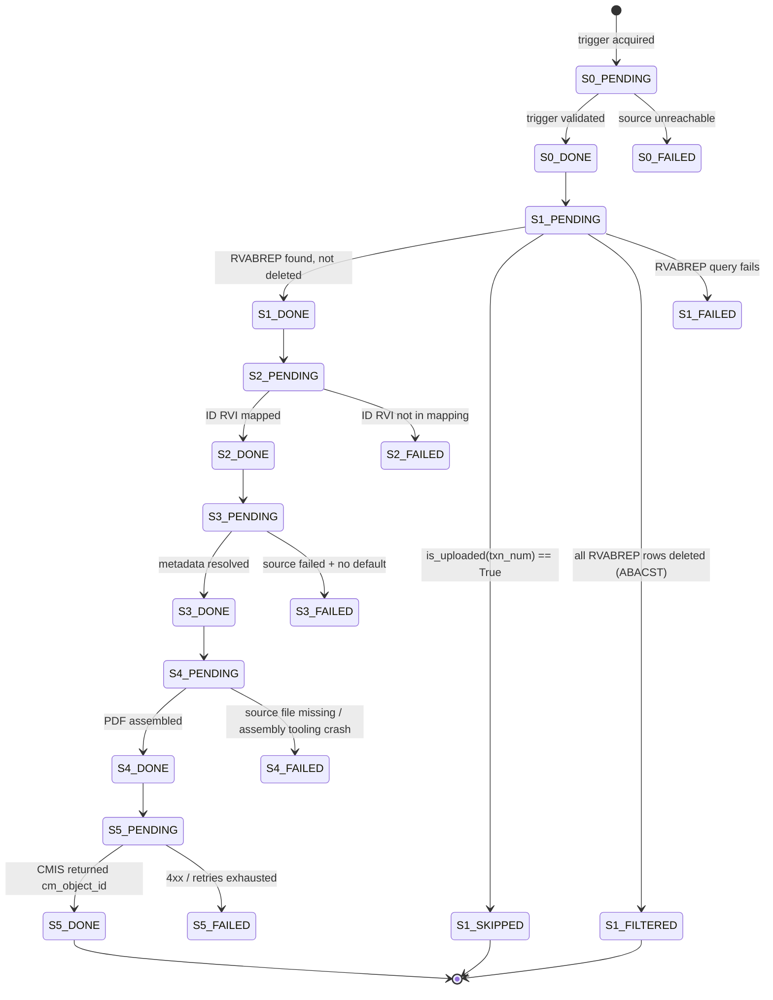
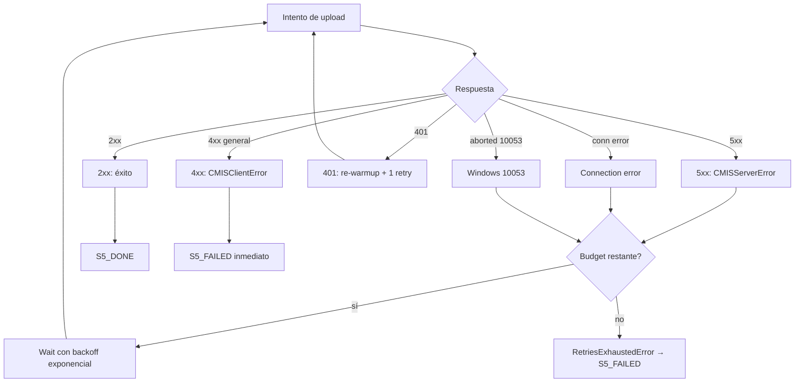

# Idempotencia y retries: la regla más importante del proyecto

> [← Volver al índice](../INDEX.md) · [Explanation](README.md)

## El problema que estamos resolviendo

El Principio II de la Constitución dice:

> **Idempotency is Sacred**. Every migration must be safely re-runnable. Interrupted, restarted, retried — the system must never produce a duplicate upload to Content Manager.

Eso no es un nice-to-have, es un requisito **regulatorio**. CMCourier sube documentación bancaria a Content Manager, y CM es el archivo formal del banco. Si un doc se sube dos veces, queda **duplicado** en producción — y eso:

- Rompe los reportes regulatorios (el banco le declara al regulador "tenemos 1 foto del CIF firmada" — no "2 fotos").
- Consume storage adicional pago por GB.
- Confunde a los usuarios operativos que consultan el archivo.

Cuando corrés una migración de 200,000 documentos contra un AS400 corporativo + Content Manager corporativo, **algo se va a caer**. Una conexión TLS se va a resetear. Un timeout va a vencer. Un firewall corporativo va a matar una sesión idle. El proceso va a tener que retomar. Y cuando lo haga, **bajo ningún concepto puede generar un duplicado**.

## La clave: `rvabrep_txn_num`

El RVABREP (la tabla de control de RVI en AS400) tiene una columna `RVABREPTXN` que es el identificador único del documento dentro del sistema legacy. Cada documento físico (un PDF firmado, una TIFF escaneada) tiene exactamente un `txn_num` que lo identifica de forma estable.

CMCourier lo trata como la **idempotency key absoluta**. En la tabla `migration_log` de SQLite:

```sql
CREATE TABLE migration_log (
    id INTEGER PRIMARY KEY AUTOINCREMENT,
    rvabrep_txn_num TEXT NOT NULL,
    batch_id TEXT NOT NULL,
    status TEXT NOT NULL,
    ...
    UNIQUE (rvabrep_txn_num, batch_id)
);

-- Anchor de idempotencia cross-batch.
CREATE INDEX idx_migration_log_done
    ON migration_log (rvabrep_txn_num)
    WHERE status='S5_DONE';
```

El UNIQUE constraint sobre `(rvabrep_txn_num, batch_id)` significa: dentro de un mismo batch, un documento existe **una sola vez**. El índice parcial sobre `status='S5_DONE'` significa: la query `is_uploaded(txn_num)` (que pregunta "¿este doc ya fue subido alguna vez en algún batch previo?") es **O(log n)**, instantánea aunque la tabla tenga millones de filas.

## La state machine completa

Cada doc atraviesa un grafo de estados explícito:



Estados terminales (en el sentido "el doc no avanza"):

- **`S5_DONE`**: éxito completo. El doc está en CM con un `cm_object_id` registrado.
- **`S1_SKIPPED`**: ya está en `S5_DONE` por una corrida previa (cross-batch idempotency, spec 062).
- **`S1_FILTERED`**: todas las filas RVABREP tenían `ABACST` no vacío (código de baja, spec 051). No es un error — es un doc deliberadamente excluido.
- **`Sn_FAILED`**: cualquier `n`. Se puede recuperar con `cmcourier batch retry-failed`.

## La idempotencia cross-batch

La regla más importante operativamente: **antes de hacer S1 contra RVABREP, chequear si el doc ya está en `S5_DONE`** en cualquier batch previo:

```python
# Esquema simplificado, en el orchestrator (staged.py)
for trigger in triggers:
    # Resolver txn_num primero (con un peek al RVABREP)
    txn_num = peek_txn_num(trigger)

    if tracking_store.is_uploaded(txn_num):
        # Spec 062: dejar fila de auditoría
        tracking_store.mark_stage_terminal(txn_num, batch_id, "S1_SKIPPED",
                                            error_message="cross-batch idempotency")
        continue

    # Procesar normalmente
    process_doc(trigger)
```

`is_uploaded(txn_num)` mapea a:

```sql
SELECT 1 FROM migration_log
WHERE rvabrep_txn_num = ? AND status = 'S5_DONE'
LIMIT 1
```

Con el índice parcial, ese SELECT es **constante en milisegundos** independiente del tamaño de la tabla. Una corrida que re-procesa 5000 triggers ya migrados termina en segundos sin tocar CMIS.

### Por qué hacer el check en S1 (no en S5)

Una alternativa "obvia" sería: dejar que el doc pase por S1–S4 y solo chequear idempotencia justo antes del upload en S5. Es **peor**:

- S2, S3 y S4 hacen trabajo costoso: lookups, queries de metadata, ensamblado de PDFs.
- Re-correr S1–S4 para descubrir al final "ah, ya estaba subido" desperdicia segundos por doc.
- Para 5000 docs ya migrados, eso son **minutos** de trabajo tirados.

Hacer el check en S1 corta el flujo lo antes posible. El costo es un SELECT por trigger, pero el SELECT está respaldado por el índice parcial — barato.

### Por qué `S1_SKIPPED` y no skip silencioso

Pre-spec 062, el skip era silencioso. El doc no aparecía en ninguna fila del batch actual. Operativamente, eso era opaco:

- El comando `batch show` decía "5000 triggers procesados, 0 documentos migrados" cuando deberías ver "5000 triggers procesados, 0 nuevos, 5000 ya migrados".
- El `analyze` del log no podía decir cuál txn_num cayó en cada corrida.
- Los reportes regulatorios necesitaban "cuántos docs deduplicó la corrida" — no había forma de saberlo.

Spec 062 introduce `S1_SKIPPED`: cuando `is_uploaded()` devuelve `True`, escribimos una fila en `migration_log` con `status='S1_SKIPPED'` y un mensaje "cross-batch idempotency". Ahora cada corrida tiene su rastro auditable. Hay método específico `mark_stage_terminal` (separado de `mark_stage_failed`) que **no incrementa `retry_count`** — el doc no falló, terminó su recorrido por una razón legítima.

## La política de retries en S5

S5 (upload a CMIS) es donde más cosas pueden fallar transitoriamente. La política está implementada en `CmisUploader` y diferencia por tipo:



### 4xx: fail-fast

Un 4xx significa **el server rechazó la request por una razón estructural**: payload inválido, autorización rechazada, propiedad CMIS mal nombrada, folder destino inexistente. **Reintentar no va a ayudar** — el mismo payload va a fallar de la misma forma.

Excepción especial: **401 Unauthorized**. CMIS Browser Binding usa JSESSIONID cookies. Si la cookie expira (timeout corporativo de sesión), el server devuelve 401. El uploader hace **re-warmup explícito** (pega un GET inicial que setea una nueva cookie) y reintenta **una sola vez**. Si vuelve a fallar 401, eso ya es un problema de credenciales o configuración — fail-fast.

### 5xx: retry con exponential backoff

Un 5xx significa el server tuvo un problema **interno**: 502 Bad Gateway, 503 Service Unavailable, 504 Gateway Timeout. Esos típicamente son transitorios (Alfresco haciendo GC, Tomcat saturado momentáneamente, reverse proxy reseteado).

Política:

- Intento 1 falla → wait `retry_base_delay_s` (default 2 s).
- Intento 2 falla → wait `2 × retry_base_delay_s` (4 s).
- Intento 3 falla → wait `4 × retry_base_delay_s` (8 s).
- Cap en `_MAX_BACKOFF_S = 60 s` para no esperar para siempre.
- Después de `retry_max_attempts` (default 3) → `RetriesExhaustedError` → `S5_FAILED`.

El backoff exponencial es importante para no **martillar** a un server que ya está degradado. Si CMIS está cayéndose, 50 workers retryando inmediatamente todos juntos empeoran la situación.

### Windows-10053: el caso especial

Windows tiene un error code distintivo: `WSAECONNABORTED (10053)`. Lo emite cuando un socket activo recibe un FIN del otro lado durante una transmisión, típicamente porque:

- Un antivirus corporativo (TrendMicro, McAfee, Symantec) interceptó la conexión y la cortó.
- Un firewall corporativo (Cisco ASA, Palo Alto) decidió que la sesión era sospechosa.
- El kernel del Windows server hizo un reset por presión de memoria.

CmsUploader detecta `_WINDOWS_ABORT_MARKER = "10053"` en el mensaje de la excepción y **trata el error como 5xx con sleep duplicado**. Spec original (mucho antes de 060) descubrió que el típico patrón es: un upload se aborta, esperás 4 s en lugar de 2, el próximo va bien. Sin el sleep extra, el retry inmediato volvía a ser interceptado.

### El circuit breaker

Encima de los retries por upload, hay un **circuit breaker** a nivel del cliente. Después de **N fallos consecutivos** de conexión (no 4xx, no 5xx — fallos de red puros), el circuito se abre y bloquea uploads nuevos durante un cooldown. Cuando pasa el cooldown, un upload de prueba ("half-open") decide si cierra el circuito o lo deja abierto otro ciclo.

Esto protege contra el caso "Alfresco completamente caído": en lugar de 50 workers retryando contra un server muerto, el circuit breaker corta el tráfico y deja que el operador intervenga.

## El resume granular: `batch retry-failed`

Cuando una corrida termina con fallas, podés recuperar quirúrgicamente:

```bash
# Resetear TODAS las filas *_FAILED del batch a *_PENDING
cmcourier batch retry-failed <batch_id>

# Resetear solo S4_FAILED (por ejemplo, el share de red se cayó)
cmcourier batch retry-failed <batch_id> --stage S4_FAILED

# Resetear solo S5_FAILED (por ejemplo, CMIS estuvo lento y agotó retries)
cmcourier batch retry-failed <batch_id> --stage S5_FAILED
```

Lo que `retry_failed` hace en el tracking store:

```sql
UPDATE migration_log
SET status = REPLACE(status, '_FAILED', '_PENDING')
WHERE batch_id = ? AND status LIKE '%_FAILED'
[AND status = ?]  -- si --stage está especificado
```

Después de eso, re-corrés `cmcourier <pipeline> run --batch-id <batch_id> --from-stage 4` (o el stage correspondiente) y solo los docs reseteados se procesan. Los `S5_DONE` del mismo batch se mantienen y se saltean. La idempotencia cross-batch además los protege del re-upload aunque corrieras desde S1.

## Resume en modo streaming: no hay

Modo streaming **rechaza explícitamente `from_stage > 1` y `resume_batch_id`**:

```python
if from_stage > 1:
    raise ValueError("streaming mode does not support --from-stage > 1; ...")
if resume_batch_id is not None:
    raise ValueError("streaming mode does not support --batch-id (resume); ...")
```

¿Por qué? Porque en streaming todo es un único `batch_id` y el flujo es continuo. No hay "chunks" contra los cuales resumir. Pero la idempotencia cross-batch sigue funcionando: re-corré la corrida desde cero con un `batch_id` nuevo, y los docs ya en `S5_DONE` se saltean rápido con `S1_SKIPPED`. El re-run completo es la forma de "resume" en streaming.

## Lo que NO contamos como duplicado

Hay un caso operativo común que vale la pena clarificar. Si el flujo es:

1. CMCourier hace POST a CMIS para subir el doc.
2. CMIS escribe el doc en su almacenamiento, devuelve `cm_object_id`.
3. **La conexión TCP se cae justo antes de que el cliente reciba la respuesta**.
4. CMCourier reintenta — y el server crea **otro objectId** porque el server CMIS no tiene idempotency keys propias.

En ese caso, **sí tenemos un duplicado en CMIS**. CMCourier solo registra el segundo upload (cuyo `cm_object_id` recibió de vuelta). El primero quedó huérfano en CMIS — sin que nadie sepa que existe.

Esto es una limitación conocida. La constitución dice "the system must never produce a duplicate upload" pero el contrato es **best-effort** contra el server: si el server confirma N veces sin que el cliente reciba la confirmación, eso es problema del protocolo CMIS Browser Binding, no de CMCourier.

Mitigación operativa: el operador debería periódicamente correr un check `cmcourier batch verify` (futuro) que cruza el `migration_log` contra los objetos en CMIS y detecta huérfanos. Por ahora, el riesgo se acepta y se reporta en runbooks.

## El AS400 NIARVILOG: idempotencia distribuida

Cuando `tracking.as400_sync.enabled: True` (spec 034), CMCourier también sincroniza a una tabla AS400 llamada `NIARVILOG`. Eso permite que **múltiples instancias** de CMCourier corriendo contra el mismo banco compartan estado de idempotencia.

Caso de uso: dos servidores físicos, cada uno con su propia copia de CMCourier corriendo subsets distintos del mismo dataset masivo. Cada instancia tiene su SQLite local. Pero si ambos consultaran solo su SQLite, podrían intentar subir el mismo doc independientemente. NIARVILOG es el "centralized truth" que ambos consultan antes de procesar un doc.

La sincronización es **eventually consistent** — un doc subido en host A puede tardar segundos en ser visible para host B. El daemon de sync corre periódicamente con `stale_in_progress_minutes` y `retry_attempts`. El caso patológico (race entre dos hosts) puede generar duplicados; lo limitamos eligiendo trabajo no-solapado para cada host (split por shortname prefix).

## La defensa profundidad

Repasando, idempotencia en CMCourier vive en **cuatro capas**:

1. **UNIQUE constraint en SQLite**: `(rvabrep_txn_num, batch_id)` impide duplicados intra-batch a nivel de DB.
2. **`is_uploaded()` check al inicio de S1**: previene cross-batch duplicates antes de hacer trabajo.
3. **`S1_SKIPPED` row**: deja auditoría de la deduplicación.
4. **NIARVILOG sync (opcional)**: extiende el check a múltiples hosts.

Si todas estas capas fallan simultáneamente (UNIQUE constraint deshabilitado, `is_uploaded` retorna falsamente False, NIARVILOG roto), entonces sí podés duplicar. Por eso son cuatro capas y no una.

## Ver también

- [`pipeline-stages.md`](pipeline-stages.md) — los stages que la state machine instrumenta
- [`streaming-vs-batched.md`](streaming-vs-batched.md) — por qué streaming no tiene resume granular y depende de cross-batch idempotency
- [`.specify/memory/constitution.md`](../../.specify/memory/constitution.md) — Principio II en su versión normativa
- `src/cmcourier/domain/ports.py` — `ITrackingStore` y `is_uploaded`
- `src/cmcourier/adapters/tracking/sqlite.py` — la implementación
- `specs/062-persist-filtered-skipped/` — la spec que introdujo `S1_SKIPPED` y `S1_FILTERED`
