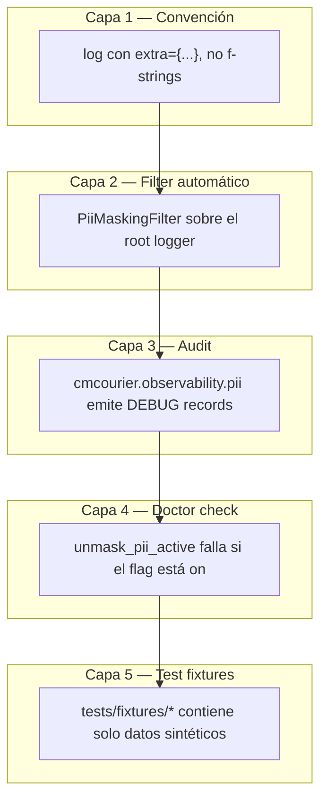

# PII handling: nunca a INFO, central por construcción

> [← Volver al índice](../INDEX.md) · [Explanation](README.md)

## El problema que estamos resolviendo

El Principio VIII de la Constitución se llama "Data Sensitivity is Non-Negotiable". El primer párrafo dice:

> CMCourier handles **bank customer data**: CIF numbers, customer names, account and card numbers, signed authorizations, and transaction documents. Mishandling this data is not a code review issue — it is a regulatory and ethical one.

Cuando una migración de 200,000 documentos corre durante horas, el log se llena de **decenas de miles de líneas**. Esas líneas terminan en:

- Archivos de log rotados en `./logs/`.
- Tickets de Jira/Slack cuando un operador pega un error.
- Capturas de pantalla que el operador manda al equipo.
- Output de stdout que un colega copia/pega.

Si el log contiene `cif=2103456789, customer_name="Juan Pérez", account=87654321`, esos valores **viajan a todos esos lugares**. Por accidente. Y una vez que viajaron, no podés deshacer el viaje.

La regla operativa entonces es **no dejar que la PII salga del proceso a `INFO` level**. Si alguien necesita ver los valores reales para debugging, eso se hace **opt-in, ruidoso, y solo en archivos rotados**.

## ¿Qué consideramos PII?

PII (Personally Identifiable Information) en el contexto bancario incluye:

- **CIF** — el identificador único del cliente en el banco.
- **Customer names** (`customer_name`, `nombre`) — nombres completos de personas físicas.
- **Account numbers** — números de cuenta.
- **Card numbers** — números de tarjeta.
- **DNI / documento de identidad** — donde aparezca.
- **Email** y **phone** — datos de contacto del cliente.
- **Address** — dirección física.
- **Full file paths que contienen lo anterior** — `/storage/2103456789/Juan_Perez/...`.

No es PII (y por ende **sí podemos loguear libremente**):

- `rvabrep_txn_num` — es un identificador interno, no apunta a un cliente sin un join.
- `batch_id` — un UUID.
- `cm_object_id` — el ID interno de Content Manager.
- `id_rvi` — el código de la clase documental (`COMP_CONTRACT`, `COMP_KYC`, etc.).
- `system_id`, `shortname` — identificadores operativos.
- `status_code` HTTP, `duration_ms`, métricas de performance.

La distinción es: **un dato es PII si vincula directamente con una persona física**. `txn_num=12345` no te dice nada de quién es; `cif=2103456789` te identifica a Juan Pérez en el sistema bancario.

## La técnica: denylist + filter central

CMCourier no resuelve PII "regex sobre los mensajes". El approach es:

1. **Toda la data sensible se pasa a logs por `extra={...}`** — nunca embebida en el f-string del mensaje. El contrato es:

```python
# ✓ BIEN
log.info("doc resolved", extra={"cif": cif, "txn_num": txn_num})

# ⛔ MAL
log.info(f"doc resolved for CIF={cif} txn={txn_num}")
```

2. **Un `PiiMaskingFilter` mira cada `LogRecord` antes del format y redacta los `extra` que matcheen un denylist**. La redacción reemplaza el valor por `MASK = "***"`. El **nombre del campo se preserva** — eso es seguro (te dice qué se redactó, no a quién).

3. **El denylist es central**. Vive en `observability/pii.py`:

```python
DENYLIST: frozenset[str] = frozenset({
    "cif",
    "customer_name",
    "account_number",
    "nombre",
    "phone",
    "email",
    "address",
    "dni",
})

PII_PREFIX: str = "pii_"  # cualquier campo con prefijo pii_ también se redacta
```

Cualquier campo cuyo nombre matchee el denylist (case-insensitive) o arranque con `pii_` se redacta.

## El filter en acción

```python
class PiiMaskingFilter(logging.Filter):
    def filter(self, record: logging.LogRecord) -> bool:
        masked: list[str] = []
        for key in list(record.__dict__):
            if self._is_pii(key) and record.__dict__[key] != MASK:
                record.__dict__[key] = MASK
                masked.append(key)
        if masked:
            _audit.debug("pii_masked", extra={"fields": ",".join(sorted(masked))})
        return True
```

Tres cosas que vale la pena notar:

1. **Itera sobre `record.__dict__`**. Eso captura tanto los `extra={...}` del caller como atributos inyectados por otros filters. Es comprehensive.

2. **Reemplaza in-place**. El `LogRecord` que llega a los handlers ya tiene los valores enmascarados. Cero chance de que un handler downstream vea el valor original.

3. **Emite un audit record a DEBUG**. Cada vez que redacta, loguea (a DEBUG, no INFO) qué campos redactó — los **nombres**, no los valores. Eso te da observabilidad sobre la disciplina de PII: ¿cuántas veces estamos pasando CIF a logs? ¿Algún field name nuevo que debería estar en el denylist?

El audit record va a un logger separado (`cmcourier.observability.pii`). Está a DEBUG porque no querés inundar INFO con "se redactó algo" — pero está disponible si subís el level para auditar.

## La sutileza: `name` NO está en el denylist

Hay un comment notable en `pii.py`:

```python
# NOTA: ``name`` intencionalmente NO está acá aunque el nombre del cliente
# sea PII — colisiona con ``LogRecord.name`` (el nombre del logger), lo
# cual enmascararía la identidad del logger y dispara una recursión infinita
# en el audit-log. Usar ``customer_name`` / ``nombre`` para el campo de
# cliente del banco en su lugar.
```

`LogRecord.name` es **el nombre del logger** (ej. `cmcourier.adapters.upload`). Si redactáramos cualquier campo llamado `name`, redactaríamos eso, y el formatter de logs tendría un valor incomprensible. Peor: el audit record que emite el filter es **un logging.info(...)** que también tiene un `name` — redactarlo dispara el filter de nuevo en el record del audit, infinitamente.

La fix es convencional: para el nombre del cliente, **siempre usamos `customer_name` o `nombre`** (en español), nunca `name`. Es una convención de naming, no una limitación técnica.

## La sutileza dos: property names de CMIS

CMIS propaga las propiedades como `clbNonGroup.BAC_CIF`, `cmcourier:Nombre_Cliente`, etc. Eso son nombres de propiedad **del wire format**, no nombres de variable Python. Cuando estos nombres aparecen como keys en el `extra` del log (por ejemplo cuando logueamos el dict de propiedades enviado en una request multipart), también queremos redactarlos.

`is_pii_name` aplica varias normalizaciones para que estos matcheen:

```python
def is_pii_name(field_name: str) -> bool:
    lower = field_name.lower()
    if lower in DENYLIST or lower.startswith(PII_PREFIX):
        return True
    suffix = lower
    for sep in (".", ":"):
        if sep in suffix:
            suffix = suffix.rsplit(sep, 1)[1]
    bare = suffix.removeprefix("bac_")
    if suffix in DENYLIST or bare in DENYLIST:
        return True
    return any(token in DENYLIST for token in suffix.split("_") if token)
```

Casos cubiertos:

- `cif` → ya en denylist directo.
- `BAC_CIF` → suffix = `bac_cif` → bare = `cif` → match.
- `clbNonGroup.BAC_CIF` → split por `.` → suffix = `bac_cif` → bare = `cif` → match.
- `cmcourier:Nombre_Cliente` → split por `:` → suffix = `nombre_cliente` → split por `_` → token `nombre` matchea.
- `cif_normalized` → split por `_` → token `cif` matchea.

Es comprehensive deliberadamente. Mejor falsos positivos (un nombre random que casualmente contiene "cif" como substring) que falsos negativos (PII real que se cuela).

## El `--unmask-pii` flag: opt-in ruidoso

A veces realmente necesitás ver el valor real. Estás debuggeando un caso específico, un cliente reportó un problema, querés trazar exactamente qué CIF está fallando. Para eso existe `observability.unmask_pii: bool = False`.

Cuando lo activás:

1. **El startup grita**. El comando `doctor` hace un check `unmask_pii_active` que **siempre falla** cuando el flag está on. La salida en stderr dice:

   ```
   ⚠️  WARNING: observability.unmask_pii is True. PII values will appear
       verbatim in log files at INFO level. Make sure:
       1. The current run is happening on an isolated environment.
       2. No log files will be shipped to ticketing or chat systems.
       3. This is reverted to false after the debug session.
   ```

2. **Sigue masking en stdout/stderr en producción**. El flag solo cambia los archivos rotados; nunca los streams interactivos del operador.

3. **Es opt-in por config, no por flag de CLI**. No querés que un `cmcourier ... --unmask-pii` accidental en un comando termine en logs productivos. Tenés que editar el YAML deliberadamente.

La intención: **molestar lo suficiente** como para que el operador piense dos veces. Si encendiste unmask para debuggear y olvidaste apagarlo, el próximo `doctor` te lo va a recordar.

## `mask_dict`: el helper para casos no-LogRecord

El filter cubre todos los `log.info(..., extra={...})`. Pero hay casos donde necesitás enmascarar un dict **fuera del logging framework** — por ejemplo, en una excepción que carga el dict en `self.context`:

```python
class CMISServerError(UploadError):
    def __init__(self, *, status_code: int, response_body: str = "") -> None:
        super().__init__("CMIS server error", status_code=status_code, response_body=response_body)
```

Si `response_body` contiene PII (porque CMIS te devolvió un error con datos del cliente en el body), el `str(exc)` lo va a incluir. Para eso `observability/pii.py` exporta `mask_dict`:

```python
def mask_dict(properties: Mapping[str, str], *, unmask: bool = False) -> dict[str, str]:
    if unmask:
        return dict(properties)
    return {k: (MASK if is_pii_name(k) else v) for k, v in properties.items()}
```

El `CmisUploader` lo usa cuando logueamos las properties enviadas en un upload:

```python
log.info("uploading", extra=mask_dict(properties, unmask=self._unmask_pii))
```

`unmask` es el escape hatch propagado desde la config.

## La pirámide de la disciplina



Cada capa es defensiva. Si la capa 1 falla (alguien escribió un f-string con CIF), la capa 2 no la captura porque ya está embebida en el mensaje. Pero la capa 5 garantiza que los tests no traen PII real. La capa 4 garantiza que un operador no encienda unmask y se olvide.

## Test fixtures: solo data sintética

`tests/fixtures/` contiene CSVs y respuestas mock. **Cero PII real**. Las reglas:

- Los CIF en los fixtures son números obviamente fake (`9999000001`, `9999000002`...).
- Los nombres son `Juan Test`, `María Prueba`, `Cliente Anónimo`.
- Las account numbers son patrones repetidos (`11111111`, `22222222`).
- Las direcciones son inventadas (`Calle Falsa 123`).

Si en algún momento un fixture llegara con valores que **parecen reales** (formato correcto de CIF, nombre creíble), eso se considera un incidente y se reemplaza inmediatamente. No "fix in next commit" — fix ya. La Constitución lo dice explícito:

> If a real-looking CIF, name, or account number ends up in git, it is replaced — no exceptions, no "fix in next commit".

## Lo que NO hace el filter

- **No hace regex sobre el body del mensaje**. Si un caller escribe `log.info(f"CIF is {cif}")`, el CIF queda visible. Eso es bug del caller, no del filter. Política: code review enforces que las invocaciones de log siempre usen `extra={}`.

- **No persiste un mapping de "valor original → mask"**. La redacción es lossy. Si necesitás trazar un valor específico, encendé `unmask_pii` en un entorno aislado.

- **No cubre stdout/stderr fuera del logging framework**. Si un código hace `print(f"CIF={cif}")` directo a stdout, eso no pasa por el filter. La política operativa: no se usa `print` en código productivo. Hay un check de ruff para esto.

## Adicional: PII en el TUI

El TUI muestra docs en progreso. ¿Mostramos CIFs en pantalla? **No**. El TUI muestra:

- `txn_num` — safe.
- `shortname` (el ID del cliente operativo, no su nombre) — safe.
- `system_id` — safe.
- `status`, `cm_object_type` — safe.
- Tamaños, tiempos, métricas — safe.

Si algún tab quisiera mostrar el nombre del cliente o el CIF para "facilitar el debug", esa feature requiere un toggle explícito que use `--unmask-pii` y deje rastro auditable. No hay tal feature todavía.

## Resumen operativo

| Capa | Mecanismo | Defaults |
|------|-----------|----------|
| 1 — Calling convention | `extra={...}` no f-strings | Enforced en review |
| 2 — Filter | `PiiMaskingFilter` sobre el root logger | Activo siempre |
| 3 — Audit | DEBUG record de qué se redactó | Activo, level DEBUG |
| 4 — Escape hatch | `observability.unmask_pii` | False default |
| 5 — Doctor check | `unmask_pii_active` falla doctor si True | Activo siempre |
| 6 — Test fixtures | Solo data sintética | Política, sin tooling |

Si todas estas defensas fallan simultáneamente, alguien deliberadamente sabotee y eso es problema de personas, no de código. Hasta ese punto, la disciplina es robusta.

## Ver también

- [`.specify/memory/constitution.md`](../../.specify/memory/constitution.md) — Principio VIII en su versión normativa
- [`pipeline-stages.md`](pipeline-stages.md) — los stages que generan PII en sus payloads
- `src/cmcourier/observability/pii.py` — la implementación completa (~125 líneas)
- `src/cmcourier/cli/doctor.py` — el check `unmask_pii_active`
- `src/cmcourier/adapters/upload/cmis_uploader.py` — uso de `mask_dict` antes de loguear properties
