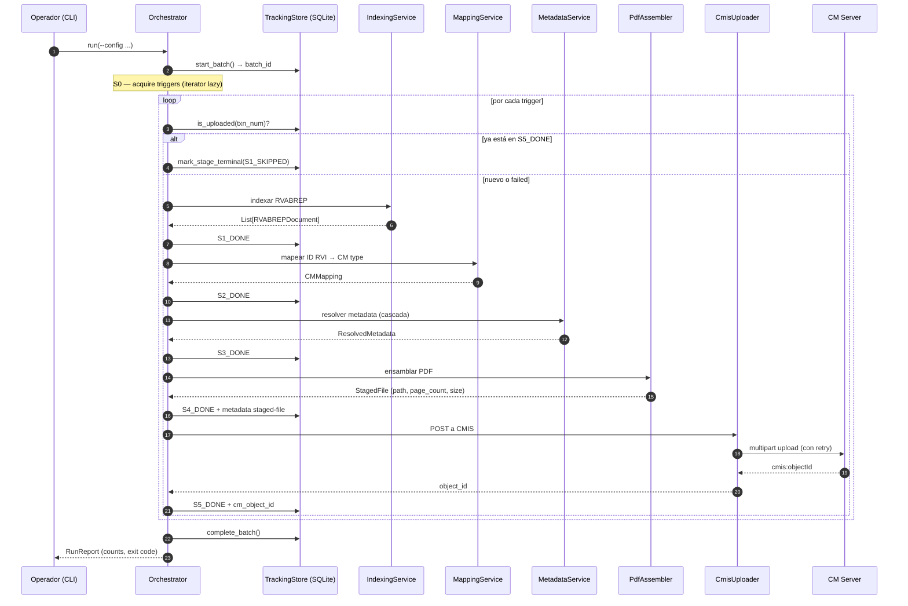

# Pipeline stages: la vida de un documento de S0 a S7

> [← Volver al índice](../INDEX.md) · [Explanation](README.md)

## El problema que estamos resolviendo

Migrar un documento del RVI de AS400 a Content Manager no es **una operación** — es **siete**. Hay que conseguir el trigger, indexarlo contra la tabla RVABREP, decidir qué tipo de CM le toca, resolver todos los campos de metadata, validar que los archivos físicos existan y ensamblar el PDF final, subirlo por CMIS, anotar el resultado para idempotencia. Cada una de esas operaciones puede fallar por motivos distintos, requiere recursos distintos, y se beneficia de paralelismos distintos.

El tool original mezclaba todo en un solo método. El resultado era el clásico: un fallo en la línea 800 no te decía si era un problema de red, de schema, de filesystem o de lógica. Imposible retrear "solo la parte del upload" porque no había "parte" — había un solo monolito.

CMCourier separa el ciclo de vida en **siete stages explícitos**, con contratos claros entre uno y otro y persistencia entre cada paso. Eso te compra observabilidad granular, retries quirúrgicos y testabilidad por capas.

## Los siete stages, de un vistazo

| # | Nombre | Responsabilidad | Servicio principal | Excepciones típicas |
|---|--------|------------------|--------------------|---------------------|
| S0 | Trigger acquisition | Sacar triggers de la fuente (CSV/RVABREP/local-scan) | `S0Strategy` (4 implementaciones) | `TriggerError` |
| S1 | Indexing | Querear RVABREP, descartar borrados (`ABACST`), expandir a `RVABREPDocument`s | `IndexingService` | `RVABREPNotFoundError`, `RVABREPDeletedError`, `RVABREPDuplicateError` |
| S2 | Mapping | Resolver ID RVI → CM type + folder destino | `MappingService` | `IDRViNotMappedError` |
| S3 | Metadata resolution | Resolver cada campo por la cascada de fuentes | `MetadataService` | `SourceFailedError`, `DefaultValidationFailedError` |
| S4 | Assembly | Validar archivos fuente y ensamblar el PDF | `PdfAssembler` (+ `ProcessPoolExecutor` post-066) | `SourceFileMissingError`, `PDFAssemblyFailedError` |
| S5 | Upload | POST a CMIS Browser Binding con retry/circuit breaker | `CmisUploader` (httpx HTTP/2) | `CMISClientError`, `CMISServerError`, `RetriesExhaustedError` |
| S6 | Tracking | Escribir estado a SQLite (y opcionalmente AS400 NIARVILOG) | `SQLiteTrackingStore`, `As400NiarvilogSync` | `TrackingError` (no propaga) |
| S7 | Idempotency marker | El check `is_uploaded()` que arranca la próxima corrida | `TrackingStore.is_uploaded()` | — |

S7 no es realmente "un stage que corre"; es el **gancho cross-batch** que la próxima corrida usa para saltar lo ya subido. Lo listamos para que la idempotencia tenga un nombre, no porque haya código que se ejecute "en S7" durante una corrida.

## El ciclo de vida visto desde la cola de tareas



Cada flecha hacia el `TrackingStore` es una transición de estado **persistida**. Esa persistencia es la base de la idempotencia y del resume.

## Stage por stage: en qué corre, qué tira, qué deja

### S0 — Trigger acquisition

**Qué hace**: convierte un descriptor de fuente (path del YAML, slug `rvabrep`, etc.) en un iterator lazy de `Trigger`s. Cuatro estrategias concretas:

- `CsvTriggerStrategy` — pandas, lee fila por fila, emite `ClientTrigger`.
- `DirectRvabrepTriggerStrategy` — escanea la fuente RVABREP (CSV o AS400), emite un trigger por fila.
- `LocalScanTriggerStrategy` — escanea un árbol de archivos, hace cross-check contra RVABREP.
- `SingleDocTriggerStrategy` — emite un solo trigger desde args de CLI.

**Dónde corre**: thread principal del orchestrator. El iterator es **lazy** — nunca materializamos la lista completa (Principio IV: streaming over buffering). Una migración de 200k triggers no carga 200k objetos en RAM.

**Qué tira**: `TriggerError` si la fuente está inalcanzable, malformada o vacía. Subclases: `RVABREPNotFoundError`, `RVABREPDeletedError`, `RVABREPDuplicateError`.

**Qué deja en el tracking store**: nada directamente. S0 alimenta a S1; S1 es quien hace el primer INSERT a `migration_log`.

### S1 — Indexing

**Qué hace**: por cada trigger, consulta la tabla RVABREP y expande el resultado en uno o más `RVABREPDocument`s (un trigger puede mapear a múltiples documentos físicos). Antes de devolver, descarta filas marcadas con código de baja (`ABACST` no vacío) — esas se reportan como `S1_FILTERED` en lugar de `S1_DONE` (spec 051).

También chequea idempotencia cross-batch acá: si `tracking.is_uploaded(txn_num)` devuelve `True`, el doc se anota como `S1_SKIPPED` (spec 062) y no avanza. Pre-062 el skip era silencioso; ahora deja rastro auditable.

**Dónde corre**: en modo batched, dentro de los `prep_workers` (threads). En modo streaming, dentro de los **producers** del bucket. Es I/O-bound (espera la respuesta de RVABREP), así que threads escalan bien.

**Qué tira**: `RVABREPNotFoundError`, `RVABREPDeletedError`, `RVABREPDuplicateError`, `IndexingError`.

**Qué deja en tracking**:
- `S1_PENDING` al arrancar.
- `S1_DONE` al terminar con éxito.
- `S1_SKIPPED` si ya está en `S5_DONE` por una corrida previa (cross-batch idempotency).
- `S1_FILTERED` si todas las filas RVABREP están con código de baja.

### S2 — Mapping

**Qué hace**: traduce el `ID RVI` (un identificador del modelo documental de RVI) al `cm_object_type` y la `cm_folder` correspondientes en Content Manager. La traducción se carga al startup desde un CSV (`MapeoRVI_CM.csv`) que mantiene el banco. Es un lookup en un dict.

**Dónde corre**: mismo thread que S1 (el producer/prep_worker). Es CPU-trivial — un dict.get().

**Qué tira**: `IDRViNotMappedError` cuando el ID RVI no aparece en el mapping cargado. Eso indica que el banco agregó un tipo nuevo al modelo documental y nadie actualizó el CSV.

**Qué deja en tracking**: `S2_PENDING` / `S2_DONE` / `S2_FAILED`.

### S3 — Metadata resolution

**Qué hace**: cada campo del `cm_object_type` resultante de S2 tiene una lista de **fuentes** y un valor por defecto. Las fuentes se prueban en orden — la primera que devuelve un valor válido gana. Si todas fallan, se prueba el default. Si el default tampoco pasa validación, se levanta `DefaultValidationFailedError`.

Las fuentes pueden ser:
- `trigger:<campo>` — sacar del trigger original.
- `rvabrep:<campo>` — sacar de la fila RVABREP.
- `csv:<alias>` — querear una CSV de metadatos (clientes, cuentas, etc.).
- `as400:<alias>` — querear AS400.

Con `prefetch_enabled: True` (default), los CSV de metadatos se pre-cargan en memoria al startup; AS400 se queryea por documento. Con el cache de 037 activo (post-MVP §9), las resoluciones recientes se memoizan en SQLite con TTL.

**Dónde corre**: mismo thread que S1/S2. Es mixto — CSV es en memoria (rápido), AS400 es red (lento). De ahí que el cache exista.

**Qué tira**: `SourceFailedError`, `DefaultValidationFailedError`, `MetadataError`.

**Qué deja en tracking**: `S3_PENDING` / `S3_DONE` / `S3_FAILED`.

### S4 — Assembly

**Qué hace**: valida que los archivos físicos referenciados por `RVABREPDocument` existan en el `source_root` configurado. Después ensambla el PDF final:

- TIFFs multi-página → `img2pdf.convert(...)` (fast path, no decodifica)
- TIFFs con compresión LZW → Pillow (decodifica, recompone como PDF)
- PDFs → passthrough (los mete como están)
- JPEGs → img2pdf
- Múltiples archivos → PyPDF2 merge

**Dónde corre**: **acá hay magia importante**. Antes de la spec 066, corría inline en el thread del producer. Resultado: con `prep_workers: 16` el throughput era < 5 docs/s porque el GIL serializaba todo el trabajo de img2pdf+PIL+PyPDF2 (que son C extensions que no siempre liberan el GIL).

Post-066 (default `s4_use_processes: True`), S4 corre en un `ProcessPoolExecutor` con `multiprocessing.get_context("spawn")`. Cada proceso worker tiene su propio intérprete Python y su propio GIL, así que el paralelismo es real a nivel de SO. El thread productor hace `pool.submit(_pool_assemble, doc).result()` y se bloquea — pero **el bloqueo libera el GIL**, así que otros producers avanzan con S1/S2/S3 en paralelo.

Ver [`processpool-for-pdf-assembly.md`](processpool-for-pdf-assembly.md) para el detalle de por qué `spawn` y no `fork`.

**Qué tira**: `SourceFileMissingError` (con `__reduce__` para que pickle pueda cruzar el process boundary), `PDFAssemblyFailedError` (idem), `AssemblyError`.

**Qué deja en tracking**: `S4_PENDING` / `S4_DONE` / `S4_FAILED`. Cuando termina con éxito, también persiste la metadata del staged file (`source_file_path`, `page_count`, `file_size_bytes`) vía `record_staged_file_metadata` (spec 058).

### S5 — Upload

**Qué hace**: hace POST multipart al CMIS Browser Binding de IBM Content Manager. Incluye:

- Warmup del JSESSIONID (lazy, una vez por session lifetime).
- Verificación / creación recursiva de carpetas con cache en memoria.
- Upload streaming con `httpx[http2]` — el archivo se lee de disco bajo demanda.
- `BandwidthLimiter` opcional para redes corporativas con throttling.
- Retry policy diferenciada por tipo de error (ver [`idempotency-and-retries.md`](idempotency-and-retries.md)).

**Dónde corre**: en un `ThreadPoolExecutor` dimensionado por `cmis.workers` (resizable por AIMD). Cuando las heavy/light lanes están activas, se divide en dos pools (ver [`heavy-light-lanes.md`](heavy-light-lanes.md)).

**Qué tira**: `CMISClientError` (4xx — fail fast), `CMISServerError` (5xx — retry), `RetriesExhaustedError` (presupuesto agotado).

**Qué deja en tracking**: `S5_PENDING` / `S5_DONE` (con `cm_object_id`) / `S5_FAILED`.

### S6 — Tracking

**Qué hace**: persiste el resultado en SQLite. Implementación con WAL mode + writer thread separado + escritura batch (cola drenada cada ~500 items o 1 segundo).

Cuando `tracking.as400_sync.enabled = True`, también sincroniza a la tabla AS400 `NIARVILOG` (spec 034) — eso permite idempotencia distribuida entre múltiples instancias corriendo contra el mismo banco.

**Dónde corre**: el writer thread es un daemon separado. Los stages emiten por una `queue.Queue` y vuelven inmediato. **Las fallas de tracking NO bloquean el pipeline** (contrato): se loguean como `TrackingError` y se siguen. La regla es: si SQLite muere, perdemos observabilidad pero el upload ya está confirmado por CM — el daño está acotado.

**Qué tira**: `TrackingError`, pero **no propaga al caller**.

**Qué deja**: filas en `migration_log` con la state machine completa.

### S7 — Idempotency marker

**Qué hace**: no hay código que "corra" en S7. S7 es **la regla**: la próxima vez que arranque una corrida, el orchestrator llama `tracking.is_uploaded(txn_num)` al inicio de S1, y si devuelve `True`, el doc se marca `S1_SKIPPED` y no se procesa.

La implementación es un índice SQL:

```sql
INDEX ON migration_log (rvabrep_txn_num) WHERE status='S5_DONE'
```

Eso permite que `is_uploaded()` sea O(log n) y la corrida de un batch sobre 200k docs ya migrados termine en segundos sin tocar CMIS.

## Por qué separar stages: el caso del retry quirúrgico

Imaginá que tu corrida cae en el medio. 8000 docs procesados, 200 con `S4_FAILED` (un share de red se cayó), 50 con `S5_FAILED` (CMIS devolvió 503 por mucho tiempo). Querés recuperar.

**Con stages**: `cmcourier batch retry-failed <batch_id> --stage S4_FAILED` resetea solo esas 200 filas a `S4_PENDING`. La próxima corrida arranca por S0, encuentra esos triggers, los reindexa, los re-mappea (rápido), los re-resuelve (cached), y se va directo a S4. Las otras 7800 ya en `S5_DONE` se saltean en S1. Las 50 de `S5_FAILED` se resetean separadas con otro `retry-failed --stage S5_FAILED` cuando CMIS vuelva.

**Sin stages** (un solo "DONE/FAILED"): no podés distinguir un fallo de filesystem de uno de red. Cualquier retry re-ejecuta todo desde cero. Para 200 docs eso es minutos extra; para 2000 son horas.

## Por qué separar stages: el caso de la observabilidad

`MetricsRecorder` mantiene un `_StageBucket` independiente por cada uno de S0–S7. Cada bucket calcula p50, p95, p99 y count separados. Cuando el sistema está lento, el resumen `batch_summary` te dice cuál stage la está chupando:

```
S1: p95=120ms count=5000
S3: p95=890ms count=4920   ← AS400 está lento
S4: p95=2400ms count=4900
S5: p95=18000ms count=4900 ← CMIS está peor todavía
```

Sin esa separación tendrías un solo número agregado y a debuggear a ciegas.

## Cómo se mapea esto a los modos de ejecución

En **modo batched** (default), `MultiBatchOrchestrator` divide los triggers en chunks de `batch_size`. El chunk K hace S1–S4 en su `prep_workers`-thread pool mientras el chunk K-1 hace S5 en el pool compartido — overlap N=2. Los stages **dentro de un chunk** son secuenciales por doc; el paralelismo es entre docs.

En **modo streaming** (spec 063), `StreamingOrchestrator` colapsa todo a un solo `batch_id` y monta un bucket entre los producers (que corren S1–S4) y los consumers (que corren S5). Ver [`streaming-vs-batched.md`](streaming-vs-batched.md).

En ambos modos, los stages siguen siendo siete y la state machine no cambia. Lo que cambia es **cómo se los coordina**.

## Ver también

- [`streaming-vs-batched.md`](streaming-vs-batched.md) — los dos modos que orquestan estos stages
- [`idempotency-and-retries.md`](idempotency-and-retries.md) — cómo se aplica la state machine para resume y retry
- [`architecture-overview.md`](architecture-overview.md) — la arquitectura que hace que esta separación se sostenga
- la spec de dominio del proyecto — descripción canónica de RVABREP, CMIS y el modelo documental
