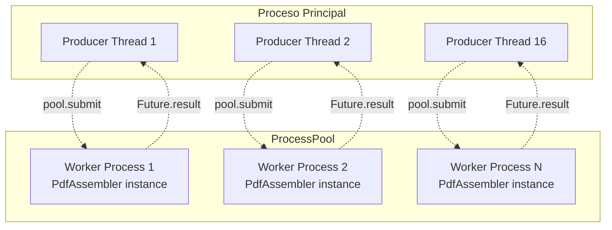

# ProcessPool para PDF assembly: por qué procesos y no threads en S4

> [← Volver al índice](../INDEX.md) · [Explanation](README.md)

## El problema que estamos resolviendo

Spec 066 (octubre 2025) descubrió, durante una corrida streaming real con `prep_workers: 16` y un mix de 5000 docs, que el throughput agregado de PREP era **< 5 docs/s**. El TUI mostraba todos los 16 productores "in flight" — pero el bucket level estaba casi en cero. Es decir: había trabajo entregándose, pero salía despacio.

Diagnóstico: **el GIL serializaba S4**. La etapa de ensamblado de PDFs (`img2pdf` + `Pillow` + `PyPDF2`) es CPU-bound y está dominada por trabajo de C extensions que **no siempre liberan el GIL**. Tenías 16 threads coexistiendo en el proceso, pero **un solo thread corría a la vez** durante S4. Los otros 15 estaban esperando el GIL.

S1 (indexing), S2 (mapping) y S3 (metadata) son todos lookups en memoria — son tan rápidos que el GIL no los serializa de manera significativa, y además sueltan el GIL durante el I/O hacia AS400/CSV. S5 (upload) idem — `httpx` libera el GIL durante las syscalls de red.

Pero S4... S4 es **decodificar TIFFs**, **escribir PDFs**, **mezclar páginas con PyPDF2**. Esas operaciones son cómputo puro y muchas de ellas ni se molestan en liberar el GIL. Resultado: con 16 threads, el throughput de PDF assembly era ~1 doc/s, idéntico al de 1 thread.

## La solución: procesos en lugar de threads

Spec 066 introdujo `processing.s4_use_processes: bool = True` (new default). Cuando está activo, S4 corre en un `ProcessPoolExecutor` con N procesos workers. Cada proceso tiene **su propio intérprete Python** y **su propio GIL**. El paralelismo es real a nivel de sistema operativo.



Workflow por doc:

1. El productor (thread) corre S1, S2, S3 inline.
2. Llega a S4 → `pool.submit(_pool_assemble, doc).result()`.
3. El submit serializa el `RVABREPDocument` con `pickle`, lo manda al worker via IPC.
4. **El thread productor se bloquea en `.result()` — y ese bloqueo libera el GIL**.
5. Mientras el thread productor duerme, otros productores corren S1/S2/S3 en paralelo (verdadero paralelismo Python ahora porque el GIL está libre).
6. El worker process llama `self._worker_assembler.assemble(doc)` con paralelismo real (cada worker tiene su propio GIL).
7. Cuando termina, devuelve el `StagedFile` por IPC.
8. `Future.result()` devuelve, el thread productor sigue con la cola de trabajo.

El resultado: con `s4_max_processes: 8` (o `os.cpu_count()`) y un workload dominado por S4, el throughput escala **~8× linear**. Los 16 threads ahora sí están ocupados de verdad: 8 en S1/S2/S3, 8 esperando workers de S4 que están todos chocando CPU.

## Por qué `spawn` y no `fork`

Esta es la parte sutil. `ProcessPoolExecutor` te deja elegir cómo se crean los procesos workers:

- **`fork`** (default en Linux pre-Python-3.14): clona el proceso padre con `fork()` de Unix. Rápido. Hereda el estado de memoria.
- **`spawn`** (default en Windows y macOS desde 3.8): arranca un intérprete Python nuevo y re-importa los módulos necesarios. Más lento de iniciar, pero limpio.
- **`forkserver`** (variante): un proceso server que forkea bajo demanda.

CMCourier **fuerza `spawn` explícitamente**:

```python
# adapters/assembly/pool.py
spawn_ctx = multiprocessing.get_context("spawn")
pool = ProcessPoolExecutor(
    max_workers=workers,
    initializer=_pool_init,
    initargs=(config,),
    mp_context=spawn_ctx,
)
```

¿Por qué no `fork`, que es más rápido?

**Porque el proceso padre es multi-threaded**. En el momento que CMCourier arranca el pool, ya tiene corriendo:

- N threads productores (`prep_workers`).
- M threads consumidores (`cmis.workers`).
- El thread daemon del `AutoTuneController`.
- El thread daemon del `LaneController` (si lanes está enabled).
- El writer thread del SQLite tracking store.
- El thread del `_BandwidthSampler`.

`fork()` en un proceso multi-threaded es **peligroso**:

1. Solo el thread que llama `fork()` existe en el hijo. Los otros threads "desaparecen", pero el estado de memoria que compartían (locks, condition variables, internal state de glibc/python) queda como estaba en el momento del fork.
2. Si alguno de esos threads tenía un lock cuando ocurrió el fork, en el hijo ese lock está **lockeado por un thread que no existe**. Cualquier intento de lockearlo deadlockea.
3. Python 3.12 oficialmente emite `DeprecationWarning` cuando ves esto: ["Calling fork() at this point may lead to deadlocks in the child"](https://docs.python.org/3/library/os.html#os.fork). Python 3.14 cambió el default a `forkserver` por esta razón.

`spawn` arma un intérprete fresco. El hijo importa los módulos necesarios, corre `_pool_init` (un callable a nivel de módulo) que instancia un `PdfAssembler` propio, y queda listo. Cero herencia de locks o state corrompido. **El costo es startup: 200-500 ms por worker la primera vez**. Amortizado a nada en una corrida de minutos.

## El contrato de picklability

`spawn` tiene una consecuencia importante: **todo lo que cruza el process boundary se serializa con `pickle`**. Eso aplica a:

- Los `initargs` que recibe el initializer (`AssemblerConfig` → tiene que ser picklable).
- Los argumentos que recibe `_pool_assemble` (`RVABREPDocument` → tiene que ser picklable).
- El return value (`StagedFile` → tiene que ser picklable).
- **Las excepciones que el worker levanta y el caller re-lanza** (`SourceFileMissingError`, `PDFAssemblyFailedError` → tienen que ser picklables).

Los modelos de dominio son `@dataclass(frozen=True, slots=True)` — picklables por construcción. Las excepciones requirieron trabajo extra.

### El problema del `__init__` kwargs-only

Las excepciones de S4 tienen `__init__` con **keyword-only args**:

```python
class SourceFileMissingError(AssemblyError):
    def __init__(self, *, file_path: str) -> None:
        super().__init__("Source file missing on file server", file_path=file_path)
        self.file_path = file_path
```

El comportamiento default de `pickle` para reconstruir una excepción es:

```python
cls(*args)
```

Pero `SourceFileMissingError.__init__` no acepta args posicionales — solo `file_path=...`. Pickle reconstruye con `SourceFileMissingError(file_path)` y falla: `TypeError: __init__() takes 1 positional argument`.

### La fix: `__reduce__`

Cada excepción que puede cruzar process boundary define `__reduce__` (post-066):

```python
class SourceFileMissingError(AssemblyError):
    def __init__(self, *, file_path: str) -> None:
        super().__init__("Source file missing on file server", file_path=file_path)
        self.file_path = file_path

    def __reduce__(self) -> tuple[object, tuple[object, ...]]:
        # 066: reconstrucción pickle-safe.
        return (_reconstruct_source_file_missing, (self.file_path,))


def _reconstruct_source_file_missing(file_path: str) -> SourceFileMissingError:
    return SourceFileMissingError(file_path=file_path)
```

`__reduce__` le dice a pickle: "para reconstruirme, llamá `_reconstruct_source_file_missing(self.file_path)`". El helper a nivel de módulo (necesario para que sea picklable él mismo) hace el call con kwargs correctos.

Lo mismo para `PDFAssemblyFailedError` con `__reduce__` que toma `(txn_num, reason)`.

**Tomalo como regla general**: cualquier excepción que pueda viajar del worker al main process necesita `__reduce__`. El resto de excepciones (S0/S1/S2/S3/S5/S6) no lo necesitan porque no cruzan boundaries de proceso.

## El initializer y el singleton de módulo

Cada vez que el pool levanta un worker (al startup), corre el callable `initializer` con `initargs`. Eso es donde construimos el `PdfAssembler` una vez por worker, en lugar de reconstruirlo por cada call:

```python
# Singleton por worker, a nivel de módulo.
_worker_assembler: PdfAssembler | None = None


def _pool_init(config: AssemblerConfig) -> None:
    """Initializer del ProcessPoolExecutor — corre una vez por worker."""
    global _worker_assembler
    _worker_assembler = PdfAssembler(config)


def _pool_assemble(document: RVABREPDocument) -> StagedFile:
    """Entry point del worker — usa el singleton."""
    if _worker_assembler is None:
        raise RuntimeError("_pool_assemble called before _pool_init")
    return _worker_assembler.assemble(document)
```

¿Por qué un global de módulo? Porque `ProcessPoolExecutor` no te deja pasar state custom entre la inicialización y los calls. El truco canónico es **un global de módulo en el proceso del worker**, populado por el initializer.

Y por qué los helpers (`_pool_init`, `_pool_assemble`) están a nivel de módulo (no anidados): **picklability**. `ProcessPoolExecutor` necesita poder pickle-ar la referencia al callable cuando lo envía a otro proceso. Lambdas, funciones anidadas y métodos bound son no-picklables; solo se puede `import` por nombre. Por eso viven al top level de `adapters/assembly/pool.py`.

## El tradeoff de memoria

Cada proceso worker es **un intérprete Python completo** + el `PdfAssembler` con sus referencias a Pillow, img2pdf, PyPDF2. Eso pesa **~30–50 MB de RSS por worker**.

Con `s4_max_processes: 8` agregás ~250–400 MB al footprint total del proceso CMCourier. Para corridas operativas en servidores con 8+ GB de RAM, irrelevante. Para corridas en notebooks o entornos con poca RAM, podés bajar `s4_max_processes` a 4 o incluso 2.

El IPC overhead (pickle + write a pipe + read en el otro lado) agrega **+1-5 ms por doc**. Si tu PDF assembly tarda 500 ms - 5 s (típico), eso es < 1% de overhead. Insignificante.

## El escape hatch

Hay casos donde querés volver al shape pre-066. Por ejemplo:

- Tu workload tiene archivos uniformemente chicos (PDFs de 2 páginas, JPEGs). El startup de los workers no se amortiza.
- Estás debuggeando S4 y necesitás el stack trace en el proceso principal (los stack traces a través de pickle no son tan ricos como inline).

Para esos casos: `processing.s4_use_processes: false`. El `StagedPipeline._s4_one` cae al shape inline:

```python
if self._s4_pool is not None:
    return self._s4_pool.submit(_pool_assemble, doc).result()
return self._assembler.assemble(doc)  # inline, en el thread productor
```

Cero cambios en el resto del pipeline. La spec 066 lo declara explícito: "set to false to restore the 063/064/065 inline behaviour byte-identically".

## Lo que NO ganaste

`ProcessPoolExecutor` no es una bala mágica. Cosas que **no** mejoraron con 066:

- **S1 / S2 / S3**: siguen corriendo en threads. No los movimos a procesos porque no los necesitan (sueltan el GIL durante I/O) y porque acoplarlos a IPC sería pagar overhead sin razón.
- **S5**: idem. `httpx` libera el GIL durante las syscalls de red. 16 threads concurrentes en S5 sí escalan.
- **Tracking store**: no toca el pool. Sigue siendo writer thread + queue + SQLite.
- **El AIMD controller**: el budget que tunea es de **threads** del pool de S5, no de procesos de S4. Son loops independientes.

## Anti-pattern: "voy a mover todo a procesos"

No. Procesos cuestan: startup, RAM, IPC. Solo valen la pena cuando el GIL es **demonstrablemente** el cuello de botella. La forma de saber:

1. Mirá el TUI. Si BUCKET muestra producers "in flight" pero el bucket level está bajo y los consumers están idle → el bottleneck es el throughput de PREP, no UPLOAD.
2. Comparate `prep_docs_per_s` con `upload_docs_per_s`. Si PREP << UPLOAD, hay que mejorar PREP.
3. Mirá los slow-ops del log. Si el top-N está dominado por `s4_assemble` con `duration_ms > 1000`, eso confirma S4 como bottleneck.
4. Solo ahí encendé/subí `s4_use_processes`.

S1/S2/S3 muy raramente justifican procesos en este proyecto.

## Ver también

- [`pipeline-stages.md`](pipeline-stages.md) — qué es S4 y dónde encaja en el pipeline
- [`the-bucket-pattern.md`](the-bucket-pattern.md) — cómo S4 alimenta el bucket en streaming
- `src/cmcourier/adapters/assembly/pool.py` — la implementación completa (~100 líneas)
- `src/cmcourier/adapters/assembly/pdf_assembler.py` — el `PdfAssembler` que corre adentro de cada worker
- `specs/066-s4-process-pool/` — la spec con el diagnóstico original
- `src/cmcourier/domain/exceptions.py` — donde viven los `__reduce__` para picklability
