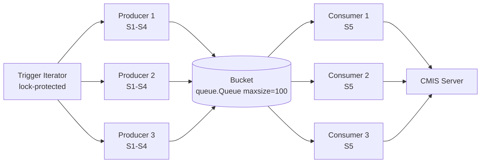

# Streaming vs Batched: dos modos, un mismo pipeline

> [← Volver al índice](../INDEX.md) · [Explanation](README.md)

## El problema que estamos resolviendo

La pipeline interna es la misma: S0 → S1 → ... → S5 → S6. Lo que cambia es **cómo le entregás trabajo al cluster de workers** cuando tenés 200, 5000 o 200000 documentos para procesar y solo una cantidad limitada de RAM, ancho de banda y workers.

CMCourier ofrece dos modos:

- **`batched`** (default) — `MultiBatchOrchestrator`, overlap producer-consumer con N=2 chunks.
- **`streaming`** (spec 063) — `StreamingOrchestrator`, un bucket acotado entre productores y consumidores.

Cada uno gana en escenarios distintos. La elección no es estética: es un tradeoff entre **resumibilidad**, **pico de memoria** y **complejidad operativa**.

## El modo batched: dividir y solapar

### Cómo funciona

`MultiBatchOrchestrator` toma el iterator de triggers de S0 y lo **chunkea** en bloques de `batch_size` docs. Por cada chunk:

1. Reserva un `batch_id` propio en el tracking store.
2. Reserva un `MetricsRecorder` propio (para que las métricas y los slow-ops queden aisladas por chunk).
3. Ejecuta S1→S4 (la fase **PREP**) en un thread pool propio del chunk, dimensionado por `processing.prep_workers`.
4. Empuja los staged files a una `queue.Queue` chica.
5. Ejecuta S5 (la fase **UPLOAD**) tomando de esa queue, contra un thread pool **compartido entre chunks** dimensionado por `cmis.workers`.

Cuando `batches_in_flight: 2` (default), mientras el chunk K hace UPLOAD, el chunk K+1 ya está haciendo PREP en paralelo. El overlap llena el tiempo muerto que de otro modo tendrías esperando a que termine UPLOAD para arrancar el próximo PREP.

```mermaid
gantt
    title Modo batched con batches_in_flight=2
    dateFormat X
    axisFormat %s

    section Chunk 1
    PREP (S1-S4)   :done, c1prep, 0, 6
    UPLOAD (S5)    :active, c1up, after c1prep, 8

    section Chunk 2
    PREP (S1-S4)   :done, c2prep, after c1prep, 6
    UPLOAD (S5)    :active, c2up, after c1up, 8

    section Chunk 3
    PREP (S1-S4)   :done, c3prep, after c2prep, 6
    UPLOAD (S5)    :active, c3up, after c2up, 8
```



### Qué te compra

- **Resume directo**. Cada chunk tiene su `batch_id` persistido. Si la corrida se cae en el chunk 7 (de 20), arrancás de nuevo con `--batch-id <id-del-7> --from-stage S5` y solo retomás el upload del chunk que faltaba terminar.
- **Aislamiento de fallas**. Si el chunk 5 explota por un bug raro, los chunks 6..20 siguen procesándose. El reporte final lista `failed_chunks` separadamente.
- **Métricas por chunk**. Cada `MetricsRecorder` emite su propio `batch_summary` y su propio archivo `slow-ops-{date}.jsonl`. Podés comparar chunk a chunk.
- **TUI con tabs CHUNKS y DETAIL**. La UI muestra una fila por chunk con su estado, progreso y métricas — muy útil para corridas largas.

### Dónde sufre

- **Pico de memoria de cada chunk**. El producer del chunk K acumula `batch_size` staged files en su queue antes de que el consumer S5 los empiece a procesar. Si `batch_size: 1000` y cada staged file pesa 5 MB en promedio, eso son 5 GB en disco temp. Cuando `batches_in_flight: 2` y el K+1 ya está preparando, podés tener 10 GB en flight.
- **El consumer S5 se queda mirando el techo entre chunks**. Cuando el chunk K termina, hay un pequeño hueco antes de que el chunk K+1 entregue suficiente trabajo para llenar el pool S5. Con AIMD agresivo (post-068) esto se nota menos, pero el shape de "ondas" sigue ahí.
- **El cap de `batches_in_flight` es 2** en el MVP. Hubo análisis de subir a N=3..5 pero quedó diferido — el refactor afecta el sharing del worker pool, los recorders, y la state machine de `ChunkState`.

## El modo streaming: el bucket continuo

### Cómo funciona

`StreamingOrchestrator` (spec 063) elimina el concepto de chunk:

- **Un solo `batch_id`** para toda la corrida.
- **Un solo `MetricsRecorder`** que el AIMD lee directamente.
- **Una `queue.Queue` acotada** llamada **el bucket**, dimensionada por `processing.streaming.bucket_size` (default 100).
- N productores (`prep_workers`) sacan triggers de un iterator compartido (protegido por lock), corren S1–S4, y hacen `bucket.put(item)`. Cuando el bucket está lleno, `put` bloquea → **back-pressure natural** sobre PREP.
- M consumidores (dimensionados igual que `cmis.workers`) hacen `bucket.get()`, corren S5. Cuando el bucket está vacío, `get` bloquea en un futex (no spinloop) → los consumers están idle gratis.
- Cuando el iterator de triggers se agota, el producer que lo observa empuja **N poison pills** al bucket (una por cada consumer) y sale. Cada consumer que saca un poison pill termina.



Ver [`the-bucket-pattern.md`](the-bucket-pattern.md) para el detalle del patrón producer-consumer y cómo el back-pressure mantiene la memoria acotada.

### Qué te compra

- **Pico de memoria fijo**. Independiente del tamaño del dataset: el bucket nunca tiene más que `bucket_size` items. Si cada item es ~5 MB y `bucket_size: 100`, tu peak de RAM por temporales es ~500 MB. Punto. Te puede correr una migración de 5 millones de docs con el mismo peak que una de 500.
- **Cero huecos entre "chunks"**. No hay chunks. S5 está ocupado siempre que el bucket no esté vacío. Mientras los producers se mantengan a la par, los consumers están al 100% de su `cmis.workers`.
- **AIMD apunta a una sola serie de p95**. No tiene que decidir contra "el chunk activo de S5"; lee del único recorder de la corrida. Las decisiones son más estables.

### Dónde sufre

- **No hay resume**. Esta es la limitación grande. `from_stage > 1` y `resume_batch_id` están **explícitamente rechazados** (raise `ValueError`) en modo streaming. ¿Por qué? Porque no hay chunks contra los cuales resumir — la corrida es un único batch lógico que el orchestrator no puede partir a mitad. Si la corrida se cae, la única forma de retomar es **re-correrla**. La idempotencia cross-batch (spec 062) hace que los docs ya en `S5_DONE` se salteen rápido (con fila `S1_SKIPPED` para auditoría), así que el re-run no re-sube nada, pero sí tiene que reprocesar S0/S1 para volver a descubrirlos.
- **El tab CHUNKS degrada**. Hay un solo `ChunkState` sintético. El TUI shippea un tab **BUCKET** específico para streaming (spec 064) que muestra fill level, throughput de prep, throughput de upload, y la sub-block LANES si está activa. Pero si tu workflow operativo dependía del CHUNKS tab (visualizar progreso por chunk), eso ya no aplica.
- **Tunear `bucket_size` es un arte**. Muy chico → los producers se bloquean en `put` aunque haya capacidad. Muy grande → perdés la ventaja de memoria acotada. Empezar en 100 y subir solo si el BUCKET tab muestra el bucket constantemente lleno **y** los consumers idle.

## Cuándo elegir cada uno

| Escenario | Modo recomendado | Por qué |
|-----------|------------------|---------|
| Corrida operativa, dataset de 1k–20k docs, infra estable | `batched` | Resume disponible, métricas por chunk útiles. La memoria no es problema a esta escala. |
| Corrida operativa, dataset de 200k+ docs | `streaming` | El peak de RAM se controla con un solo knob (`bucket_size`). Resume cae a "re-correr con idempotencia cross-batch". |
| Corrida con red intermitente (red corporativa caprichosa) | `batched` con `batches_in_flight: 1` | Resume granular por chunk. Cuando la red vuelve, retomás el chunk que se cayó sin reprocesar lo anterior. |
| Migración de prueba contra Alfresco staging | cualquiera de los dos | Probá los dos y mirá el TUI. La diferencia se ve enseguida. |
| Smoke test (`--total 10`) | `batched` | Más simple. El overhead del bucket no se justifica para 10 docs. |
| Backfill nocturno largo, sin operador mirando | `streaming` | Memoria acotada → no hay riesgo de OOM. Si se cae, mañana se re-corre con idempotencia cross-batch. |
| Cuentas regulatorias donde necesitás un `batch_id` distinto por "cohorte" lógica de cliente | `batched` con el slug del cohort como `--batch-id` | El audit trail por cohort es directo. |

## Lo que NO cambia entre modos

Vale la pena enfatizar lo que es invariante:

- Los **siete stages** son los mismos. La lógica de S1–S5 no cambia ni un comentario.
- La **state machine** de `migration_log` es la misma. `S1_PENDING → S1_DONE → S2_PENDING → ...` idéntico.
- La **idempotencia** es la misma. `is_uploaded(txn_num)` se chequea en S1 en ambos modos.
- El **TUI** es el mismo (`tui/app.py`), aunque algunos tabs degradan o se reemplazan en streaming.
- El **AIMD** corre en ambos modos. Lo único que cambia es contra qué recorder lee p95 (un único recorder en streaming, el recorder del chunk activo de upload en batched).
- Las **heavy/light lanes** funcionan en ambos modos. Pre-070 había un bug grave (dos `LaneController` distintos en streaming + lanes) — ver [`heavy-light-lanes.md`](heavy-light-lanes.md).

## El selector

```yaml
processing:
  mode: "batched"  # o "streaming"
  batches_in_flight: 2  # ignorado en streaming
  prep_workers: 4

  streaming:
    bucket_size: 100  # solo aplica en streaming

  heavy_light_lanes:
    enabled: false  # ortogonal al mode
```

Pasar `mode: "streaming"` con `--from-stage 2` o `--batch-id <foo>` en la CLI levanta `ValueError` de entrada. Esa validación es **explícita** en el constructor del orchestrator — no es un side effect ni un check escondido.

## Anti-pattern: "voy a usar streaming porque suena más moderno"

No. Streaming gana **cuando la memoria es el cuello de botella** y aceptás perder resume granular. Si tu dataset entra cómodo en RAM y querés observabilidad por chunk, `batched` es la opción correcta y por eso es el default. La regla operativa: empezá con `batched`, medí, y cambiá solo cuando tengas evidencia (TUI mostrando RAM cerca del límite, o tiempos muertos grandes entre chunks).

## Ver también

- [`the-bucket-pattern.md`](the-bucket-pattern.md) — cómo funciona el producer-consumer del modo streaming en detalle
- [`pipeline-stages.md`](pipeline-stages.md) — la pipeline que ambos modos coordinan
- [`heavy-light-lanes.md`](heavy-light-lanes.md) — feature ortogonal al modo, que vive adentro de S5
- [`idempotency-and-retries.md`](idempotency-and-retries.md) — cómo la idempotencia cross-batch sustituye al resume en streaming
