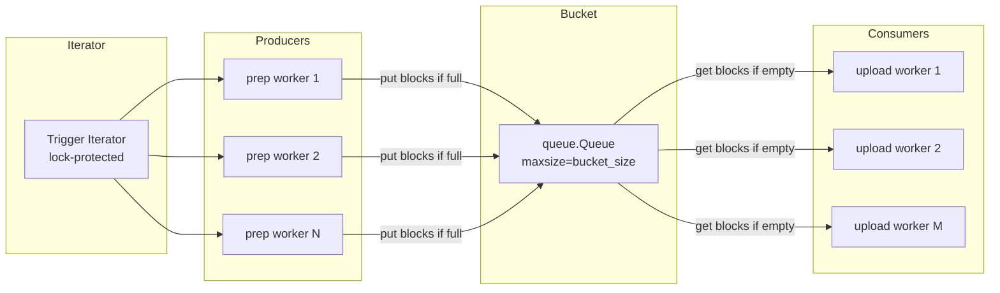
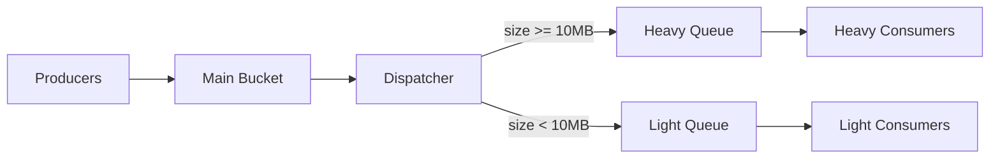

# El bucket pattern: producer-consumer con back-pressure natural

> [← Volver al índice](../INDEX.md) · [Explanation](README.md)

## El problema que estamos resolviendo

En modo streaming, los productores (S1–S4) y los consumidores (S5) corren a **velocidades distintas y variables**. S1–S4 puede ser rápido cuando los archivos chicos (resolución de metadata en caché, ensamblado de un PDF de 2 páginas). S5 puede ser lento cuando CMIS está cargado o hay un archivo de 50 MB en cola. Y al revés: a veces el assembly tarda (TIFFs grandes con LZW que decodifica Pillow) y CMIS está disponible.

¿Cómo coordinás a 4 producers y a 30 consumers para que:

1. Si los productores son más rápidos, **no llenen la RAM** con staged files esperando upload.
2. Si los consumidores son más rápidos, **no spinneen en busy-wait** consumiendo CPU mientras esperan trabajo.
3. La memoria total esté **acotada por un solo knob** que el operador entienda.
4. El shutdown sea **limpio y determinístico** cuando se agotan los triggers.

La respuesta es un patrón clásico: **producer-consumer con una cola acotada en el medio**. En CMCourier lo llamamos **el bucket**, y está implementado con `queue.Queue` de la standard library.

## El diseño en una imagen



Tres componentes, cada uno con un trabajo claro:

- **El iterator de triggers**: un único `_TriggerIter` que envuelve el iterator de S0 y protege `next()` con un `threading.Lock`. Cada trigger se entrega a **exactamente un** productor.
- **El bucket**: `queue.Queue(maxsize=bucket_size)`. Lo escriben los productores con `put`, lo leen los consumidores con `get`. Ambas operaciones son thread-safe por construcción (la Queue usa un Condition variable internamente).
- **El conjunto de productores y consumidores**: threads dedicados que corren en loops `while not poisoned: take_work; do_work; emit_result`.

## Por qué un bucket acotado en vez de una cola libre

La pregunta natural es: "¿por qué no usar `queue.Queue()` sin maxsize y dejar que los productores escriban a su ritmo?". La respuesta tiene dos partes.

### 1. Back-pressure natural

Cuando `queue.Queue(maxsize=N)` está llena, **el siguiente `put` se bloquea** hasta que un consumidor haga `get` y libere un slot. Eso es exactamente lo que querés:

- **Productores rápidos + consumidores lentos** → el bucket se llena rápido → los productores se bloquean en `put` → dejan de producir → la memoria deja de crecer.
- **Consumidores rápidos + productores lentos** → el bucket se vacía → los consumidores se bloquean en `get` → liberan CPU → cuando un productor termina y hace `put`, el primer consumidor en `get` se despierta.

No tenés que escribir **ni una línea de código de coordinación**. La `Queue` lo implementa con dos `Condition` (uno `not_full`, uno `not_empty`) y un lock interno. Vos solo decís "maxsize=100" y el sistema operativo + glibc te gestionan el sleep/wake.

Compará con la alternativa "cola libre":

```python
# Sin maxsize — MAL.
bucket = queue.Queue()

def producer():
    while True:
        item = prep(next(triggers))
        bucket.put(item)  # nunca bloquea → la cola crece sin límite
```

Si un consumidor se cuelga 5 minutos (CMIS lento), tus 8 productores siguen acumulando staged files. Con un PDF promedio de 5 MB, en 5 minutos podés tener 1500 items × 5 MB = **7.5 GB en RAM**. El proceso muere por OOM y perdés todo el progreso del batch.

### 2. Idle real, no busy-wait

`bucket.get()` (sin parámetros) **bloquea con la primitiva del SO** — un futex en Linux, un `WaitForSingleObject` en Windows. El thread queda dormido. **Cero CPU**. Cuando llega un `put`, el SO despierta exactamente al thread que estaba en la cabeza de la cola de espera.

Sin esto, tendrías que escribir algo como:

```python
# Polling — MAL.
while True:
    try:
        item = bucket.get_nowait()
    except queue.Empty:
        time.sleep(0.05)
        continue
    do_work(item)
```

Eso te come 1-5% de CPU por consumidor idle, multiplicado por N consumidores, multiplicado por el tiempo que están idle. Y además te agrega latencia (hasta 50 ms entre el `put` y el próximo intento del consumidor de despertar). El blocking `get` no tiene ninguna de esas pegas.

## El shutdown con poison pills

¿Cómo terminás esto limpio? El problema es: cuando el iterator de triggers se agota, **los consumidores están dormidos en `bucket.get()`**. No se enteran. ¿Cómo los despertás de forma determinística?

La técnica clásica: **poison pills**.

Cada productor compite por sacar triggers del `_TriggerIter`. Cuando uno hace `next()` y recibe `StopIteration`, ese productor sabe que el iterator se agotó. Pero solo **uno** lo descubre primero — los otros podrían descubrirlo después o no descubrirlo nunca (porque ya están haciendo `prep` del último trigger que sacaron).

La solución es:

1. El primer productor que ve `StopIteration` se queda con la responsabilidad del shutdown.
2. Empuja **N poison pills** al bucket — una por cada **consumidor**. El poison es un objeto sentinel (`_POISON: object = object()`).
3. Los otros productores también ven `StopIteration` cuando intentan sacar el próximo trigger y salen por su cuenta.
4. Cada consumidor que hace `get()` y recibe el sentinel `_POISON`, sale de su loop.

```python
# Schema simplificado del prep loop (streaming.py)
def _prep_loop(self, trigger_iter, bucket, ...):
    while True:
        try:
            trigger = next(trigger_iter)
        except StopIteration:
            # Soy el descubridor. Empujo N poison pills, uno por consumer.
            for _ in range(self._consumer_count):
                bucket.put(_POISON)
            return
        item = prep_one(trigger)  # S1-S4
        bucket.put(item)
```

```python
# Schema simplificado del consumer loop
def _upload_loop(self, bucket, ...):
    while True:
        item = bucket.get()
        if item is _POISON:
            return
        upload_one(item)  # S5
```

Propiedades del shutdown:

- **Determinista**: cada consumidor sale exactamente cuando saca un poison pill, no antes.
- **Sin race conditions**: aunque dos productores noten el `StopIteration`, el primero ya empujó los N pills; el segundo nota `StopIteration`, no empuja nada, sale.
- **El bucket no se llena de pills** porque los empuja un solo productor.
- **No necesita locks adicionales** — `queue.Queue` ya es thread-safe.

## Dimensionar `bucket_size`: el tradeoff entre throughput y memoria

`bucket_size` (default 100) controla el techo de items en flight. Más grande:

- **Más buffering** entre PREP y UPLOAD → un consumer lento momentáneo no bloquea a los productores rápidos durante 100 docs (vs solo 10).
- **Más memoria**. Si cada staged file mantiene un path a disco pero el `RVABREPDocument` + `ResolvedMetadata` ya cargados, calculá ~5–20 KB de objetos Python en RAM por item. Para 100 items eso es < 2 MB de overhead Python. El disco temp (los PDFs ensamblados) es lo grande — pero ese **ya está en disco**, no en RAM.

Más chico:

- **Menos memoria**. Trivial.
- **Mayor probabilidad de bloqueo cruzado**. Si `bucket_size: 5` y un upload se cuelga 30 segundos, los productores se traban después de 5 items. Si los productores son rápidos pero el upload tiene varianza alta, esto te puede dejar productores idle aunque haya trabajo.

La heurística práctica:

- Empezá en **100** (default).
- Si el BUCKET tab del TUI muestra el bucket **constantemente lleno** y los consumers **frecuentemente idle**, subí (200, 500). Significa que los productores son rápidos y los consumers la varianza alta.
- Si el bucket muestra **constantemente bajo** y los productores **siempre buscando triggers**, no toques nada — el bucket está sobredimensionado pero no hace daño.
- Si el peak de RAM te preocupa y la corrida funciona, bajá (50, 25) hasta que veas degradación de throughput.

## El bucket cuando entran las heavy/light lanes

Cuando `heavy_light_lanes.enabled: true` en streaming, el shape se complica un poco — pero los principios son los mismos. Spec 065 + 067 + 070 introducen:

- El **bucket principal** sigue siendo el rendezvous entre producers y un **dispatcher** thread.
- El dispatcher hace `bucket.get()` y, según `staged_file.size_bytes >= heavy_threshold_bytes`, hace `put` en una de **dos sub-colas**: `heavy_queue` y `light_queue` (cada una también `queue.Queue(maxsize=bucket_size)`).
- Hay dos pools de consumers: uno escuchando `heavy_queue`, otro `light_queue`, gateados por sus respectivos semáforos del `LaneController`.



El shutdown se vuelve más coreografiado: los productores empujan poison al main bucket; el dispatcher al ver poison empuja poison a las dos sub-colas; los consumers de cada lane salen. Pero la idea estructural es la misma.

Ver [`heavy-light-lanes.md`](heavy-light-lanes.md) para el racional de por qué dos lanes y cómo se balancean.

## Observabilidad del bucket

El TUI tab `BUCKET` (spec 064) muestra en vivo:

- **bucket_level / bucket_cap**: ocupación actual vs capacidad. Si está pegado al techo, los productores se están bloqueando.
- **bucket_peak**: el máximo histórico de ocupación.
- **prep_in_flight**: cuántos productores están adentro de un `prep_one` (no esperando en `put`).
- **prep_docs_per_s** / **upload_docs_per_s**: tasas estimadas por ventana deslizante de 5 s.

Esto convierte el bucket de "black box" a algo legible. Cuando prep_docs_per_s == upload_docs_per_s y bucket_level está estable en un valor intermedio, el sistema está en equilibrio — ese es el estado bueno.

## Resumen del patrón

| Propiedad | Cómo se logra |
|-----------|---------------|
| Memoria acotada | `queue.Queue(maxsize=N)` bloquea `put` cuando está lleno |
| Idle gratis | `queue.Queue.get()` bloquea con futex del SO |
| Coordinación sin locks adicionales | `queue.Queue` es thread-safe por contrato |
| Shutdown determinístico | Poison pills, uno por consumer |
| Sin race conditions | `next()` del iterator protegido por lock, todo lo demás lo cubre la Queue |
| Observabilidad | `qsize()` para fill level + ventanas deslizantes para tasas |

Es uno de esos patrones donde la standard library te resuelve el 90% del trabajo si lo dejás. Lo más fácil es pelearse con `queue.Queue` para reescribirlo "más eficiente"; lo correcto es entender que ya es eficiente y dimensionar bien el `maxsize`.

## Ver también

- [`streaming-vs-batched.md`](streaming-vs-batched.md) — cuándo elegir streaming (y por ende, el bucket) en lugar de chunks
- [`heavy-light-lanes.md`](heavy-light-lanes.md) — cómo el dispatcher divide el bucket en dos sub-colas por tamaño
- [`aimd-auto-tuning.md`](aimd-auto-tuning.md) — cómo se dimensiona el pool de consumers en runtime
- `src/cmcourier/orchestrators/streaming.py` — la implementación
