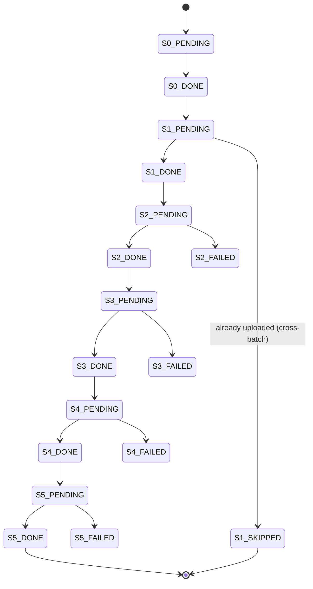

> [← Volver al índice](../INDEX.md) · [Reference](README.md)

# Tracking DB schema

SQLite DDL exacto de `tracking.db_path`. Las sentencias se ejecutan al abrir el store (`adapters/tracking/sqlite.py`). Modelo de concurrencia: WAL — un reader sincrónico en el thread principal + un writer thread daemon que drena una `queue.Queue` (hasta 500 sentencias o 1 s, lo que ocurra primero).

## PRAGMAs

```sql
PRAGMA journal_mode=WAL;
PRAGMA synchronous=OFF;
PRAGMA cache_size=-64000;    -- 64 MiB page cache
PRAGMA temp_store=MEMORY;
```

---

## Table `migration_log`

Una fila por documento por batch. La clave de idempotency es `(rvabrep_txn_num, batch_id)` + el partial index sobre `rvabrep_txn_num WHERE status='S5_DONE'`.

```sql
CREATE TABLE IF NOT EXISTS migration_log (
    id                  INTEGER PRIMARY KEY AUTOINCREMENT,
    trigger_shortname   TEXT    NOT NULL,
    trigger_cif         TEXT    NOT NULL,
    trigger_system_id   TEXT    NOT NULL,
    rvabrep_txn_num     TEXT    NOT NULL,
    rvabrep_file_name   TEXT    NOT NULL,
    batch_id            TEXT    NOT NULL,
    status              TEXT    NOT NULL,
    created_at          TEXT    NOT NULL,
    cm_object_id        TEXT,
    cm_folder           TEXT,
    cm_object_type      TEXT,
    error_message       TEXT,
    source_file_path    TEXT,
    page_count          INTEGER,
    file_size_bytes     INTEGER,
    started_at          TEXT,
    completed_at        TEXT,
    retry_count         INTEGER NOT NULL DEFAULT 0
);
```

| Column | Type | Nullable | Meaning |
|--------|------|----------|---------|
| `id` | INTEGER PK | NO | Surrogate auto-incremented. |
| `trigger_shortname` | TEXT | NO | Del `TriggerRecord`. |
| `trigger_cif` | TEXT | NO | Idem (puede ser cadena vacía). |
| `trigger_system_id` | TEXT | NO | Idem. |
| `rvabrep_txn_num` | TEXT | NO | Clave natural del documento (idempotency). |
| `rvabrep_file_name` | TEXT | NO | Nombre del archivo en RVABREP. |
| `batch_id` | TEXT | NO | FK lógico → `migration_batch.batch_id`. |
| `status` | TEXT | NO | Ver state machine abajo. |
| `created_at` | TEXT (ISO-8601) | NO | Cuando se insertó la fila. |
| `cm_object_id` | TEXT | YES | Sólo después de `S5_DONE`. |
| `cm_folder` | TEXT | YES | Folder CM resuelto en S2. |
| `cm_object_type` | TEXT | YES | Object type CM resuelto en S2. |
| `error_message` | TEXT | YES | Diagnóstico al fallar. |
| `source_file_path` | TEXT | YES | Path al archivo fuente (S4). |
| `page_count` | INTEGER | YES | Páginas del PDF ensamblado. |
| `file_size_bytes` | INTEGER | YES | Tamaño del PDF post-S4. |
| `started_at` | TEXT (ISO-8601) | YES | Inicio del stage actual. |
| `completed_at` | TEXT (ISO-8601) | YES | Fin del stage actual. |
| `retry_count` | INTEGER | NO (default 0) | Reintentos acumulados. |

### Índices

```sql
CREATE UNIQUE INDEX IF NOT EXISTS idx_migration_log_txn_batch
    ON migration_log (rvabrep_txn_num, batch_id);

CREATE INDEX IF NOT EXISTS idx_migration_log_uploaded
    ON migration_log (rvabrep_txn_num)
    WHERE status = 'S5_DONE';
```

El partial index sobre `S5_DONE` es lo que hace barato el check de cross-batch idempotency (`is_uploaded()`).

---

## Table `migration_batch`

Una fila por batch.

```sql
CREATE TABLE IF NOT EXISTS migration_batch (
    batch_id        TEXT PRIMARY KEY,
    total_records   INTEGER NOT NULL,
    started_at      TEXT NOT NULL,
    completed_at    TEXT
);
```

| Column | Type | Nullable | Meaning |
|--------|------|----------|---------|
| `batch_id` | TEXT PK | NO | Identificador (provisto por CLI o autogenerado). |
| `total_records` | INTEGER | NO | Cantidad de triggers/docs declarada al arrancar. |
| `started_at` | TEXT (ISO-8601) | NO | — |
| `completed_at` | TEXT (ISO-8601) | YES | `NULL` mientras el batch está en vuelo. |

---

## Table `document_cache` (037, opcional)

Sólo se llena cuando `metadata.cache.enabled = true`. La tabla se crea siempre (migración barata e idempotente).

```sql
CREATE TABLE IF NOT EXISTS document_cache (
    txn_num         TEXT NOT NULL,
    fields_hash     TEXT NOT NULL,
    trigger_cif     TEXT,
    properties_json TEXT NOT NULL,
    cached_at       TEXT NOT NULL,
    PRIMARY KEY (txn_num, fields_hash)
);

CREATE INDEX IF NOT EXISTS idx_document_cache_cached_at
    ON document_cache (cached_at);
```

| Column | Type | Nullable | Meaning |
|--------|------|----------|---------|
| `txn_num` | TEXT | NO (PK) | Clave natural. |
| `fields_hash` | TEXT | NO (PK) | Hash del conjunto de campos resueltos (cambia si cambia el modelo documental). |
| `trigger_cif` | TEXT | YES | CIF asociado al trigger (debugging). |
| `properties_json` | TEXT (JSON) | NO | Mapa de propiedades resueltas. |
| `cached_at` | TEXT (ISO-8601) | NO | Timestamp del último upsert. |

Eviction: TTL controlado por `metadata.cache.ttl_minutes` + el subcomando `cache clear --older-than`.

---

## State machine de `status` (column `migration_log.status`)



### Valores válidos (set completo)

| Status | Stage | Terminal? | Meaning |
|--------|-------|-----------|---------|
| `S0_PENDING` | S0 | no | Trigger aceptado, sin procesar. |
| `S0_DONE` | S0 | no | Trigger emitido a S1. |
| `S1_PENDING` | S1 | no | En indexing. |
| `S1_DONE` | S1 | no | Documento RVABREP listo. |
| `S1_SKIPPED` | S1 | **sí** | Cross-batch dedup (062) — ya existía un `S5_DONE` para este `txn_num`. |
| `S2_PENDING` | S2 | no | En mapping. |
| `S2_DONE` | S2 | no | Folder + object type resueltos. |
| `S2_FAILED` | S2 | sí (hasta retry) | `IDRViNotMappedError`. |
| `S3_PENDING` | S3 | no | En metadata resolution. |
| `S3_DONE` | S3 | no | Propiedades resueltas. |
| `S3_FAILED` | S3 | sí (hasta retry) | `SourceFailedError` / `DefaultValidationFailedError`. |
| `S4_PENDING` | S4 | no | En assembly. |
| `S4_DONE` | S4 | no | PDF listo. |
| `S4_FAILED` | S4 | sí (hasta retry) | `SourceFileMissingError` / `PDFAssemblyFailedError`. |
| `S5_PENDING` | S5 | no | En upload. |
| `S5_DONE` | S5 | **sí** | Upload exitoso. `cm_object_id` poblado. |
| `S5_FAILED` | S5 | sí (hasta retry) | `RetriesExhaustedError` / `CMISServerError` no recuperable. |

`*_FAILED` se resetea a `*_PENDING` con `cmcourier batch retry-failed --batch <id> [--stage Sn]`.

## Ver también

- [`error-codes.md`](error-codes.md) — qué exception escribe qué `status`.
- [`cli.md`](cli.md) — `cmcourier batch show`, `batch retry-failed`, `cache clear`.
- [How-to: document cache](../how-to/document-cache.md) — manejo de `document_cache`.
- [How-to: AS400 sync](../how-to/as400-sync.md) — relación con NIARVILOG (S6).
